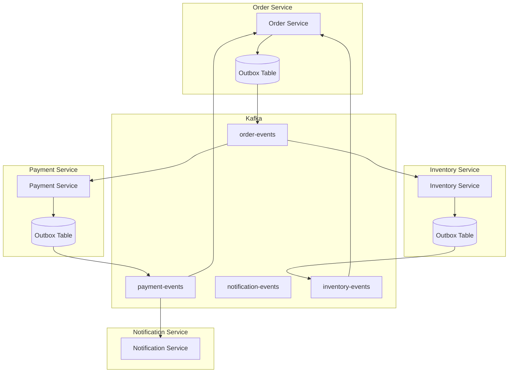
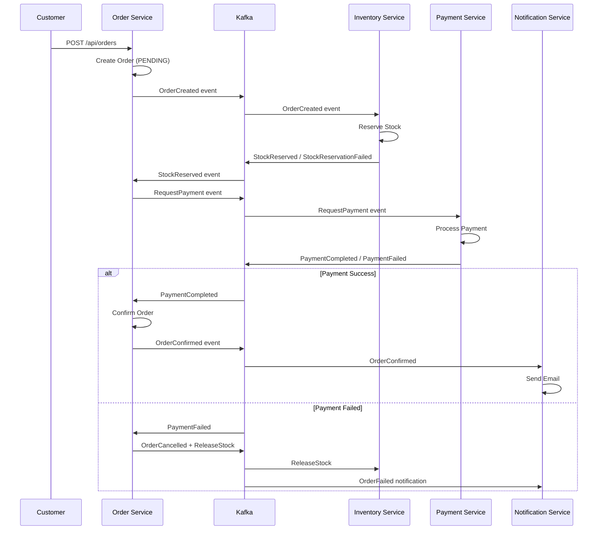

# 🚀 Phase 2: Distributed Flow - Implementation Plan

## Overview

**Objective**: Evolve the e-commerce backend from synchronous REST-based communication to an event-driven, distributed architecture using Kafka, Saga pattern, and new services (Payment & Notification).

**Phase 1 Foundation**:
- ✅ `product-service` (Port 8081) - Product catalog
- ✅ `inventory-service` (Port 8082) - Stock management with optimistic locking
- ✅ `order-service` (Port 8083) - Order orchestration with idempotency

**Phase 2 Goals**:
- Event-driven communication via Apache Kafka
- Saga pattern for distributed transactions
- Outbox pattern for reliable event publishing
- Idempotent event consumers
- New `payment-service` and `notification-service`

---

## 🏗️ Architecture Overview

### Event-Driven Flow



### Saga Pattern - Order Creation Flow



---

## 📦 New Services

### Payment Service (Port 8084)

```
payment-service/
├── src/main/java/com/ecommerce/payment/
│   ├── PaymentServiceApplication.java
│   ├── domain/
│   │   ├── model/
│   │   │   ├── Payment.java (Aggregate Root)
│   │   │   ├── PaymentId.java (Value Object)
│   │   │   ├── PaymentStatus.java (Sealed interface)
│   │   │   └── PaymentMethod.java (Enum)
│   │   └── repository/PaymentRepository.java
│   ├── application/
│   │   ├── service/PaymentService.java
│   │   └── dto/
│   └── infrastructure/
│       ├── kafka/PaymentEventConsumer.java
│       ├── kafka/PaymentEventProducer.java
│       ├── persistence/
│       └── web/PaymentController.java
└── src/main/resources/
    ├── application.yml
    └── db/migration/V1__create_payment_tables.sql
```

**Database**: `payment_db`

### Notification Service (Port 8085)

```
notification-service/
├── src/main/java/com/ecommerce/notification/
│   ├── NotificationServiceApplication.java
│   ├── domain/
│   │   ├── model/
│   │   │   ├── Notification.java
│   │   │   ├── NotificationType.java
│   │   │   └── NotificationChannel.java (EMAIL, SMS, PUSH)
│   │   └── repository/NotificationRepository.java
│   ├── application/
│   │   └── service/NotificationService.java
│   └── infrastructure/
│       ├── kafka/NotificationEventConsumer.java
│       ├── email/EmailSender.java (Mock implementation)
│       ├── persistence/
│       └── web/NotificationController.java
└── src/main/resources/
    ├── application.yml
    └── db/migration/V1__create_notification_tables.sql
```

**Database**: `notification_db`

---

## 🔑 Key Technical Patterns

### 1. Outbox Pattern

Ensures reliable event publishing by storing events in the same transaction as the aggregate:

```java
@Entity
@Table(name = "outbox_events")
public class OutboxEvent {
    @Id
    private String id;
    private String aggregateType;    // "Order", "Payment"
    private String aggregateId;       // Order ID
    private String eventType;         // "OrderCreated"
    private String payload;           // JSON
    private Instant createdAt;
    private boolean published;
}
```

A scheduled job polls unpublished events and sends them to Kafka.

### 2. Idempotent Consumers

Prevents duplicate event processing:

```java
@Entity
@Table(name = "processed_events")
public class ProcessedEvent {
    @Id
    private String eventId;
    private Instant processedAt;
}

@KafkaListener(topics = "order-events")
public void handleEvent(OrderEvent event) {
    if (processedEventRepository.existsById(event.eventId())) {
        log.info("Event {} already processed, skipping", event.eventId());
        return;
    }
    // Process event...
    processedEventRepository.save(new ProcessedEvent(event.eventId(), Instant.now()));
}
```

### 3. Saga State Machine (Java 21 Sealed Classes)

```java
public sealed interface SagaState {
    record AwaitingInventory() implements SagaState {}
    record InventoryReserved() implements SagaState {}
    record AwaitingPayment() implements SagaState {}
    record PaymentCompleted() implements SagaState {}
    record Compensating(String reason) implements SagaState {}
    record Completed() implements SagaState {}
    record Failed(String reason) implements SagaState {}
}
```

---

## 📅 Implementation Phases

| Phase | Description | Estimated Effort |
|-------|-------------|------------------|
| 2.1 | Infrastructure & Foundation | 2-3 days |
| 2.2 | Payment Service | 2-3 days |
| 2.3 | Notification Service | 1-2 days |
| 2.4 | Saga Integration | 3-4 days |
| 2.5 | Testing & Verification | 2-3 days |

**Total Estimated Time**: 10-15 days

---

## 🎯 Success Criteria

1. ✅ Orders created asynchronously via Kafka events
2. ✅ Payment service processes payments (mock)
3. ✅ Notification service sends emails (mock)
4. ✅ Saga compensates on payment failure
5. ✅ All events idempotently processed
6. ✅ Outbox ensures no lost events
7. ✅ 80%+ test coverage maintained

---

## 📋 Progress Tracking

See [PHASE2_TASK_TRACKER.md](./PHASE2_TASK_TRACKER.md) for detailed task tracking.
