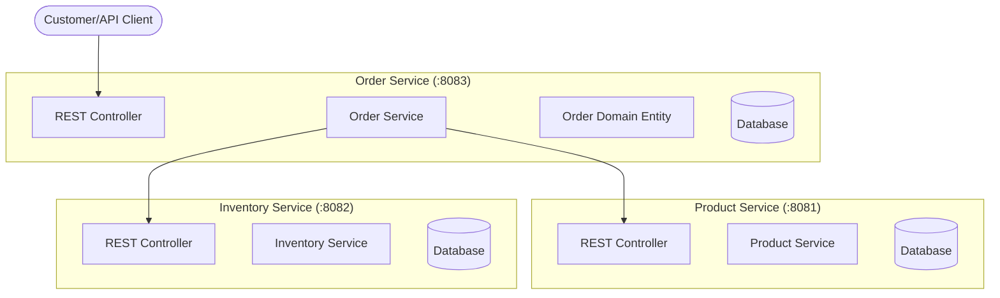
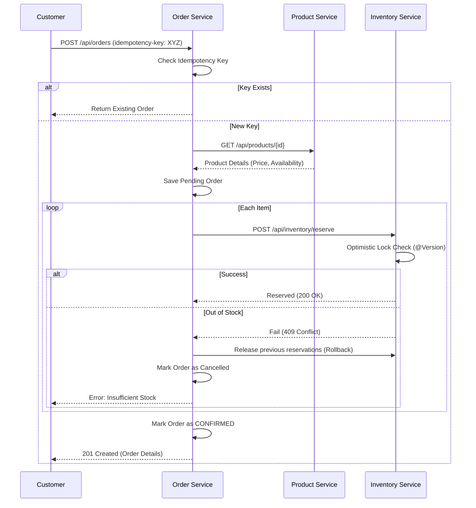

# 📦 Ecommerce Backend Phase 1: Core Domain Implementation

Welcome to the documentation for **Phase 1** of our Modern Ecommerce Backend. This phase focused on building the bedrock of the system using **Java 21**, **Spring Boot 3**, and **Hexagonal Architecture**.

---

## 🏗️ System Architecture

We followed **Domain-Driven Design (DDD)** and **Hexagonal Architecture** principles to ensure the core business logic remains independent of external technologies.

---

## 🔄 Critical Flows

### 🛒 Idempotent Order Creation Flow
The order creation process is the most complex part of Phase 1, involving multiple services and ensuring reliability.

---

## 🛠️ Microservices Breakdown

### 1. 🏷️ Product Service
The source of truth for all items in the catalog.
- **Features**: RESTful CRUD, SKU management, dynamic pricing.
- **Tech Highlights**: JPA integration, validation.

### 2. 📦 Inventory Service
Manages stock levels and reservations.
- **Optimistic Locking**: Uses JPA `@Version` to handle concurrent stock updates without database deadlocks.
- **State Integrity**: Ensures stock never drops below zero even under high load.

### 3. 📝 Order Service
Orchestrates the checkout process.
- **Idempotency**: Prevents double-charging/double-ordering on network retry using an Idempotency Key.
- **Transactional Consistency**: Partial failures during inventory reservation trigger an automated "Compensating Action" to release held stock.

---

## ☕ Java 21: The Powerhouse

This project is built from the ground up to leverage the latest LTS features:

| Feature | Usage in Project |
| :--- | :--- |
| **Sealed Hierarchies** | `OrderStatus` is a sealed interface. No more unexpected states! |
| **Records** | Used for all DTOs and immutable Domain IDs (e.g., `OrderId`, `ProductId`). |
| **Pattern Matching** | Used in `OrderService` to elegantly handle different `ReservationResult` types. |
| **Virtual Threads** | Configured to handle high-concurrency REST requests with minimal memory overhead. |

---

## 🚀 Infrastructure (Phase 1)

Our local environment is fully containerized:
- **PostgreSQL 16**: Multi-tenant database setup (separate DB per service).
- **Redis 7**: Ready for session management and distributed caching (Phase 2).
- **Flyway**: Automated database schema migrations.

---

## 🎨 Design Decisions

1. **Hexagonal Architecture**: We keep the `domain` package pure Java. No Spring, no JPA. This makes testing incredibly fast and the code future-proof.
2. **Value Objects**: Every ID is a Value Object (`OrderId`), preventing "Primitive Obsession" and developer errors (like swapping ProductID with CustomerID).
3. **Internal Consistency**: Services communicate via REST in Phase 1 for synchronous consistency. As we move to Phase 2, we will introduce Kafka for eventual consistency in non-critical paths.

---

> *"Build it right, then build it fast."* 
> 
> **End of Phase 1 Report.**
