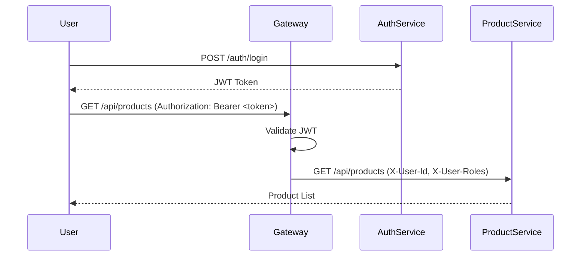

# 🔐 Security Architecture

This document describes the security mechanisms implemented in the E-commerce Microservices system.

## 🛡️ Authentication Architecture

We use a Centralized Authentication pattern with **API Gateway** acting as the gatekeeper.

1.  **Auth Service**: Responsible for user registration, login, and JWT generation.
2.  **API Gateway**: Validates the JWT for every incoming request.
3.  **Downstream Services**: Rely on the Gateway to provide user context via headers.

### Flow Diagram



## 🎟️ JWT Strategy

*   **Algorithm**: HS256 (HMAC with SHA-256).
*   **Payload**: includes `sub` (username), `userId`, and `roles`.
*   **Token Forwarding**: The Gateway extracts information from the JWT and injects it into custom headers:
    *   `X-User-Id`: The unique identifier of the user.
    *   `X-User-Name`: The username.
    *   `X-User-Roles`: Comma-separated list of roles (e.g., `CUSTOMER,ADMIN`).

## 🔑 Authorization (RBAC)

Each service has its own `SecurityConfig` to enforce Role-Based Access Control (RBAC).

| Role | Description |
| :--- | :--- |
| **CUSTOMER** | Regular user, can create orders and view their own data. |
| **ADMIN** | System administrator, full access to all resources. |
| **SERVICE** | Internal system role for service-to-service communication. |

### Example Configuration (Order Service)

```java
.authorizeHttpRequests(auth -> auth
    .requestMatchers(HttpMethod.POST, "/api/orders/**").hasRole("CUSTOMER")
    .requestMatchers(HttpMethod.GET, "/api/orders/**").hasAnyRole("CUSTOMER", "ADMIN")
    .anyRequest().authenticated()
)
```

## 🚫 Rate Limiting

Implemented at the Gateway level using Redis.

*   **Anonymous Users**: 10 requests per minute per IP.
*   **Authenticated Users**: 100 requests per minute per User ID.

## ⚙️ Configuration

Security is configured via environment variables:

| Variable | Description | Default |
| :--- | :--- | :--- |
| `JWT_SECRET` | Secret key for signing tokens | (Required in production) |
| `JWT_EXPIRATION` | Token validity in milliseconds | 86400000 (24h) |
