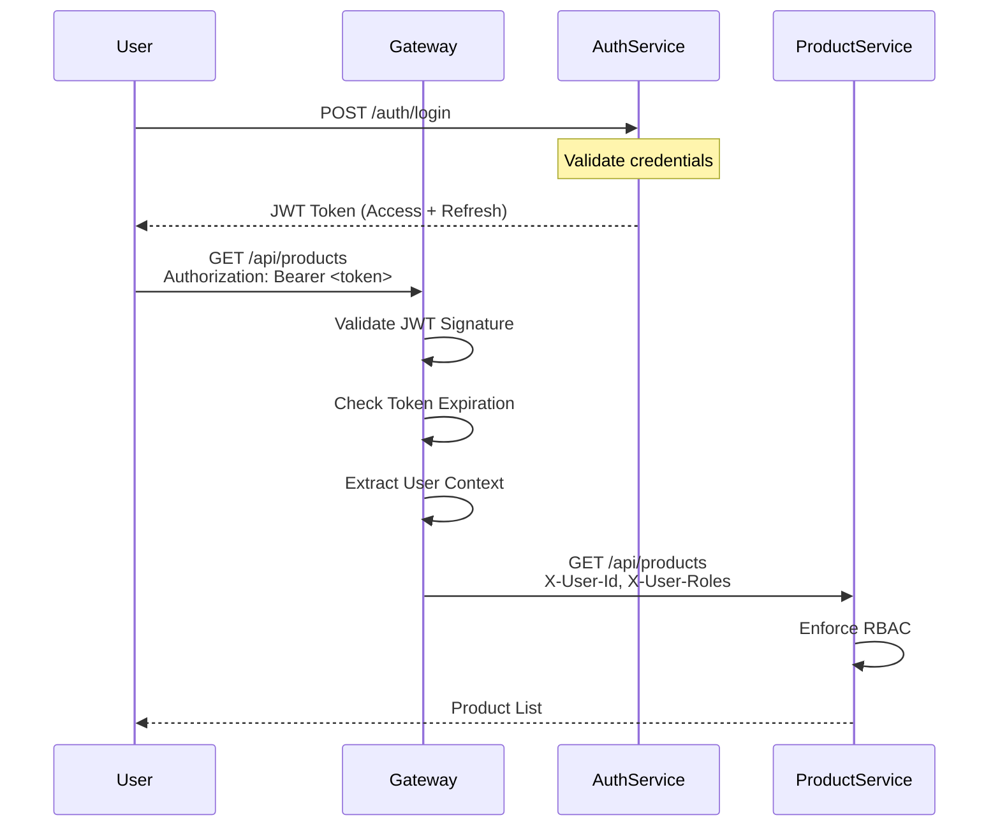
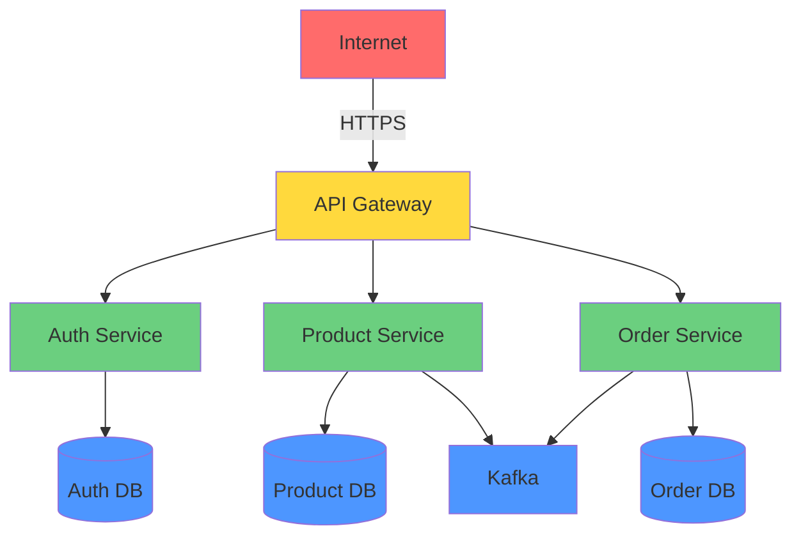

# 🔐 Security Architecture

Complete security documentation for the E-commerce Backend microservices.

---

## Table of Contents

1. [Security Overview](#security-overview)
2. [Authentication & Authorization](#authentication--authorization)
3. [Threat Model](#threat-model)
4. [Security Controls](#security-controls)
5. [Data Protection](#data-protection)
6. [Vulnerability Management](#vulnerability-management)
7. [Compliance](#compliance)
8. [Security Best Practices](#security-best-practices)

---

## Security Overview

### Security Principles

| Principle | Implementation |
|-----------|----------------|
| **Defense in Depth** | Multiple layers of security controls |
| **Least Privilege** | Minimal permissions by default |
| **Zero Trust** | Verify every request, trust nothing |
| **Secure by Default** | Security enabled out of the box |
| **Fail Securely** | Deny access on error |

### Security Architecture Layers

```
┌─────────────────────────────────────────┐
│  Layer 1: Network Security              │
│  - HTTPS/TLS, Firewall, DDoS Protection │
├─────────────────────────────────────────┤
│  Layer 2: API Gateway                   │
│  - JWT Validation, Rate Limiting, CORS  │
├─────────────────────────────────────────┤
│  Layer 3: Service Security              │
│  - RBAC, Input Validation, CSRF         │
├─────────────────────────────────────────┤
│  Layer 4: Data Security                 │
│  - Encryption at Rest, Encryption in    │
│    Transit, Data Masking                │
├─────────────────────────────────────────┤
│  Layer 5: Infrastructure Security       │
│  - Container Security, Secrets Mgmt     │
└─────────────────────────────────────────┘
```

---

## Authentication & Authorization

### Authentication Architecture

**Centralized Authentication** with API Gateway as gatekeeper:

1. **Auth Service**: User registration, login, JWT generation
2. **API Gateway**: JWT validation for all requests
3. **Downstream Services**: Trust gateway-provided user context

### Authentication Flow



### JWT Strategy

**Algorithm**: HS256 (HMAC with SHA-256)

**Token Structure**:
```json
{
  "header": {
    "alg": "HS256",
    "typ": "JWT"
  },
  "payload": {
    "sub": "customer@example.com",
    "userId": "550e8400-e29b-41d4-a716-446655440000",
    "roles": ["CUSTOMER"],
    "iat": 1642598400,
    "exp": 1642602000
  }
}
```

**Token Types**:
| Type | Validity | Purpose | Storage |
|------|----------|---------|---------|
| **Access Token** | 1 hour | API authentication | Memory (never localStorage) |
| **Refresh Token** | 7 days | Renew access token | HttpOnly cookie |

**Token Forwarding** (Gateway → Services):
- `X-User-Id`: User identifier
- `X-User-Name`: Username
- `X-User-Roles`: Comma-separated roles

### Role-Based Access Control (RBAC)

**Roles**:
| Role | Description | Permissions |
|------|-------------|-------------|
| **CUSTOMER** | Regular user | Create orders, view own data |
| **ADMIN** | System administrator | Full access to all resources |
| **SERVICE** | Internal service account | Service-to-service communication |

**Authorization Matrix**:
| Resource | GET | POST | PUT | DELETE |
|----------|-----|------|-----|--------|
| `/api/products` | Public | ADMIN | ADMIN | ADMIN |
| `/api/orders` | CUSTOMER (own) | CUSTOMER | - | - |
| `/api/orders/{id}` | CUSTOMER (own) | - | - | - |
| `/api/admin/**` | ADMIN | ADMIN | ADMIN | ADMIN |

**Example Configuration** (Order Service):
```java
@Configuration
@EnableWebSecurity
public class SecurityConfig {
    
    @Bean
    public SecurityFilterChain filterChain(HttpSecurity http) throws Exception {
        http
            .authorizeHttpRequests(auth -> auth
                .requestMatchers("/actuator/health").permitAll()
                .requestMatchers("/swagger-ui/**", "/v3/api-docs/**").permitAll()
                .requestMatchers(HttpMethod.POST, "/api/orders/**").hasRole("CUSTOMER")
                .requestMatchers(HttpMethod.GET, "/api/orders/**").hasAnyRole("CUSTOMER", "ADMIN")
                .anyRequest().authenticated()
            )
            .csrf(csrf -> csrf.disable()) // Disabled for stateless API
            .sessionManagement(session -> session
                .sessionCreationPolicy(SessionCreationPolicy.STATELESS)
            );
        return http.build();
    }
}
```

---

## Threat Model

### STRIDE Threat Analysis

#### Spoofing Identity

**Threat**: Attacker impersonates legitimate user

**Mitigations**:
- ✅ Strong password requirements (min 8 chars, complexity)
- ✅ JWT signature validation
- ✅ Token expiration (1 hour)
- ✅ Refresh token rotation
- 🔄 Multi-factor authentication (MFA) - *Planned*

#### Tampering with Data

**Threat**: Attacker modifies data in transit or at rest

**Mitigations**:
- ✅ HTTPS/TLS 1.3 for all communication
- ✅ JWT signature prevents token tampering
- ✅ Database constraints and validation
- ✅ Input validation on all endpoints
- 🔄 Database encryption at rest - *Planned*

#### Repudiation

**Threat**: User denies performing an action

**Mitigations**:
- ✅ Audit logging (who, what, when)
- ✅ Distributed tracing (correlation IDs)
- ✅ Immutable event log (Kafka)
- ✅ Database audit columns (created_at, updated_at)

#### Information Disclosure

**Threat**: Sensitive data exposed to unauthorized users

**Mitigations**:
- ✅ RBAC on all endpoints
- ✅ Sensitive data not logged (passwords, tokens)
- ✅ Error messages don't leak implementation details
- ✅ Health endpoints show minimal info in production
- 🔄 Data masking for PII - *Planned*

#### Denial of Service (DoS)

**Threat**: Attacker overwhelms system resources

**Mitigations**:
- ✅ Rate limiting (10-100 req/min per user)
- ✅ Connection pool limits
- ✅ Request timeout (30 seconds)
- ✅ Circuit breakers (Resilience4j)
- 🔄 DDoS protection (Cloudflare/AWS Shield) - *Planned*

#### Elevation of Privilege

**Threat**: Attacker gains unauthorized permissions

**Mitigations**:
- ✅ Least privilege principle
- ✅ Role validation on every request
- ✅ No default admin accounts
- ✅ Service-to-service authentication
- ✅ Principle of least privilege for database users

### Attack Surface



**Attack Vectors**:
1. **Public API** (Gateway) - Primary attack surface
2. **Database** - SQL injection, unauthorized access
3. **Kafka** - Message tampering, unauthorized consumption
4. **Dependencies** - Vulnerable libraries

---

## Security Controls

### Input Validation

**All user inputs validated**:

```java
@PostMapping("/api/products")
public ResponseEntity<ProductResponse> createProduct(
    @Valid @RequestBody CreateProductRequest request) {
    // @Valid triggers Bean Validation
    // @NotBlank, @Min, @Max, @Pattern, etc.
}
```

**Validation Rules**:
- **String length**: Max 200 chars for names, 50 for SKU
- **Numeric ranges**: Price > 0, Quantity >= 0
- **Format validation**: Email, phone, currency codes
- **Sanitization**: HTML encoding, SQL escaping

### Output Encoding

**Prevent XSS attacks**:
```java
// JSON responses auto-encoded by Jackson
// HTML responses use Thymeleaf with auto-escaping
```

### SQL Injection Prevention

**Use parameterized queries**:
```java
// ✅ Safe (JPA/JDBC parameterized)
@Query("SELECT p FROM Product p WHERE p.name = :name")
List<Product> findByName(@Param("name") String name);

// ❌ Unsafe (never do this)
String sql = "SELECT * FROM products WHERE name = '" + name + "'";
```

### CSRF Protection

**Stateless API - CSRF disabled**:
```java
.csrf(csrf -> csrf.disable())
```

**Reason**: JWT in `Authorization` header (not cookies) prevents CSRF

### CORS Configuration

**Development**:
```yaml
spring:
  cloud:
    gateway:
      globalcors:
        cors-configurations:
          '[/**]':
            allowedOrigins: "*"
```

**Production**:
```yaml
spring:
  cloud:
    gateway:
      globalcors:
        cors-configurations:
          '[/**]':
            allowedOrigins:
              - "https://app.example.com"
              - "https://admin.example.com"
            allowedMethods: [GET, POST, PUT, DELETE]
            allowedHeaders: [Authorization, Content-Type]
            maxAge: 3600
```

### Rate Limiting

**Implementation**: Redis-based token bucket

**Limits**:
| Tier | Requests/Minute | Burst |
|------|-----------------|-------|
| **Anonymous** | 10 | 5 |
| **Authenticated** | 100 | 20 |
| **Premium** | 1000 | 100 |

**Response Headers**:
```http
HTTP/1.1 429 Too Many Requests
X-RateLimit-Limit: 100
X-RateLimit-Remaining: 0
X-RateLimit-Reset: 1642598460
Retry-After: 60
```

---

## Data Protection

### Encryption in Transit

**TLS 1.3** for all communication:
- API Gateway → Services: HTTPS
- Service → Database: TLS
- Service → Kafka: TLS (production)
- Service → Redis: TLS (production)

### Encryption at Rest

**Database Encryption** (Production):
```sql
-- PostgreSQL: Transparent Data Encryption (TDE)
ALTER DATABASE product_db SET encryption = 'AES256';
```

**Secrets Encryption**:
- AWS Secrets Manager (encrypted with KMS)
- Kubernetes Secrets (encrypted with etcd encryption)

### Sensitive Data Handling

**Password Storage**:
```java
// Bcrypt with cost factor 12
String hashedPassword = BCrypt.hashpw(plainPassword, BCrypt.gensalt(12));
```

**JWT Secret**:
```yaml
jwt:
  secret: ${JWT_SECRET}  # 256-bit random key
  # Generate: openssl rand -base64 32
```

**Data Masking** (Logs):
```java
// Never log sensitive data
log.info("User {} logged in", username);  // ✅
log.info("Password: {}", password);       // ❌ NEVER!
```

### Personal Identifiable Information (PII)

**PII Fields**:
- Email addresses
- Phone numbers
- Payment information
- Addresses

**Protection**:
- ✅ RBAC on PII endpoints
- ✅ Audit logging for PII access
- 🔄 Data masking in logs - *Planned*
- 🔄 GDPR compliance (right to deletion) - *Planned*

---

## Vulnerability Management

### Dependency Scanning

**Tools**:
- **OWASP Dependency Check**: Scan for known vulnerabilities
- **Snyk**: Continuous monitoring
- **GitHub Dependabot**: Automated dependency updates

**CI/CD Integration**:
```yaml
# .github/workflows/security.yml
- name: OWASP Dependency Check
  run: ./gradlew dependencyCheckAnalyze
  
- name: Snyk Scan
  run: snyk test --severity-threshold=high
```

**Fail Build On**:
- Critical vulnerabilities
- High vulnerabilities (production)

### Container Scanning

**Trivy** for Docker image scanning:
```bash
trivy image ecommerce/product-service:latest
```

**Scan Results**:
```
Total: 0 (CRITICAL: 0, HIGH: 0, MEDIUM: 0, LOW: 0)
```

### Static Application Security Testing (SAST)

**SonarQube** for code analysis:
- SQL injection detection
- XSS vulnerability detection
- Hardcoded secrets detection
- Security hotspots

### Penetration Testing

**Schedule**: Quarterly

**Scope**:
- API endpoints
- Authentication/Authorization
- Input validation
- Session management

---

## Compliance

### OWASP Top 10 (2021)

| Risk | Status | Mitigation |
|------|--------|------------|
| **A01: Broken Access Control** | ✅ | RBAC on all endpoints |
| **A02: Cryptographic Failures** | ✅ | TLS 1.3, Bcrypt passwords |
| **A03: Injection** | ✅ | Parameterized queries, input validation |
| **A04: Insecure Design** | ✅ | Threat modeling, security reviews |
| **A05: Security Misconfiguration** | ✅ | Secure defaults, automated scanning |
| **A06: Vulnerable Components** | ✅ | Dependency scanning, updates |
| **A07: Authentication Failures** | ✅ | JWT, strong passwords, token expiration |
| **A08: Software/Data Integrity** | ✅ | Code signing, audit logging |
| **A09: Logging Failures** | ✅ | Centralized logging, audit trails |
| **A10: SSRF** | ✅ | Input validation, whitelist URLs |

### GDPR Compliance

**Data Subject Rights** (Planned):
- Right to access
- Right to rectification
- Right to erasure ("right to be forgotten")
- Right to data portability

**Implementation**:
```java
// DELETE /api/users/{id}/gdpr-delete
@DeleteMapping("/users/{id}/gdpr-delete")
@PreAuthorize("hasRole('ADMIN')")
public void gdprDelete(@PathVariable UUID id) {
    userService.gdprDelete(id);
    // Anonymize user data, delete PII
}
```

### PCI DSS (Payment Card Industry)

**Scope**: Payment Service

**Requirements**:
- ✅ No storage of full PAN (Primary Account Number)
- ✅ Tokenization via payment gateway
- ✅ TLS for card data transmission
- ✅ Access logging and monitoring

---

## Security Best Practices

### Development

**✅ Do**:
- Use parameterized queries
- Validate all inputs
- Use HTTPS everywhere
- Store secrets in environment variables
- Enable security headers
- Use latest dependencies
- Follow principle of least privilege

**❌ Don't**:
- Hardcode secrets in code
- Log sensitive data
- Disable security features
- Trust user input
- Use default credentials
- Expose stack traces in production

### Configuration

**Security Headers** (API Gateway):
```yaml
spring:
  cloud:
    gateway:
      default-filters:
        - AddResponseHeader=X-Content-Type-Options, nosniff
        - AddResponseHeader=X-Frame-Options, DENY
        - AddResponseHeader=X-XSS-Protection, 1; mode=block
        - AddResponseHeader=Strict-Transport-Security, max-age=31536000; includeSubDomains
```

### Secrets Management

**Environment Variables**:
```bash
# ✅ Good
export JWT_SECRET=$(openssl rand -base64 32)
export DB_PASSWORD=$(aws secretsmanager get-secret-value --secret-id prod/db/password)

# ❌ Bad
export JWT_SECRET="hardcoded-secret-123"
```

**Kubernetes Secrets**:
```yaml
apiVersion: v1
kind: Secret
metadata:
  name: jwt-secret
type: Opaque
data:
  JWT_SECRET: <base64-encoded-secret>
```

### Incident Response

**Security Incident Procedure**:
1. **Detect**: Monitoring alerts, user reports
2. **Contain**: Isolate affected systems
3. **Investigate**: Analyze logs, identify root cause
4. **Remediate**: Patch vulnerabilities, rotate secrets
5. **Document**: Post-mortem, lessons learned

**Emergency Contacts**:
- Security Lead: @security-lead
- On-Call Engineer: PagerDuty
- Legal/Compliance: @legal-team

---

## Security Monitoring

### Audit Logging

**Logged Events**:
- Authentication attempts (success/failure)
- Authorization failures
- Data access (PII)
- Configuration changes
- Administrative actions

**Log Format**:
```json
{
  "timestamp": "2026-01-19T10:15:30Z",
  "userId": "550e8400-e29b-41d4-a716-446655440000",
  "action": "ORDER_CREATED",
  "resource": "orders/01HQZX3Y4Z5A6B7C8D9E0F1G2H",
  "ipAddress": "192.168.1.100",
  "userAgent": "Mozilla/5.0...",
  "result": "SUCCESS"
}
```

### Security Alerts

**Critical Alerts** (PagerDuty):
- Multiple failed login attempts (> 5 in 5 min)
- Privilege escalation attempts
- Unauthorized data access
- Suspicious API usage patterns

**Warning Alerts** (Slack):
- High rate limit violations
- Deprecated API usage
- Security scan failures

---

## Security Checklist

### Pre-Production

- [ ] All secrets externalized
- [ ] HTTPS enabled
- [ ] CORS configured for production domains
- [ ] Rate limiting enabled
- [ ] Security headers configured
- [ ] Dependency scan passed
- [ ] Container scan passed
- [ ] Penetration test completed
- [ ] Security review approved

### Production

- [ ] Monitor security alerts
- [ ] Review audit logs daily
- [ ] Rotate secrets quarterly
- [ ] Update dependencies monthly
- [ ] Security scan weekly
- [ ] Penetration test quarterly
- [ ] Security training annually

---

## Next Steps

- [Configuration Reference](CONFIGURATION.md) - Secure configuration
- [Deployment Guide](DEPLOYMENT.md) - Secure deployment
- [Observability](OBSERVABILITY.md) - Security monitoring
- [Troubleshooting](TROUBLESHOOTING.md) - Security issues

---

**Document Version**: 2.0  
**Last Updated**: 2026-01-19  
**Maintained By**: Security Team
