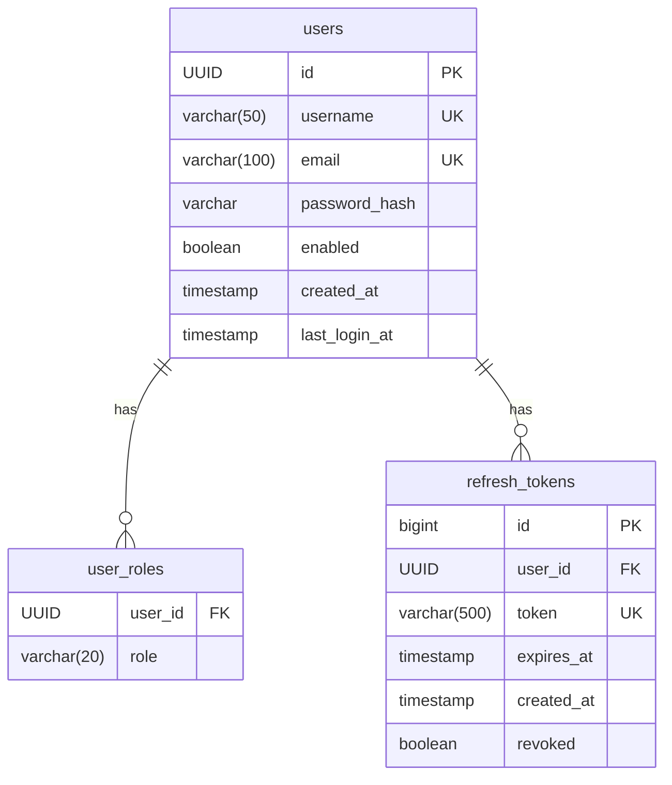
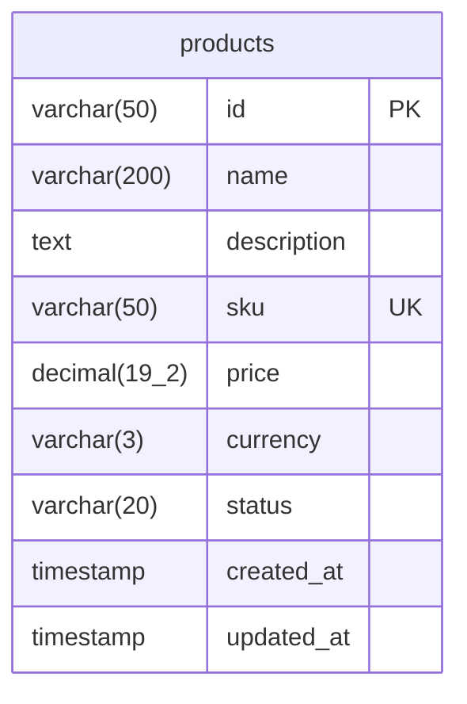
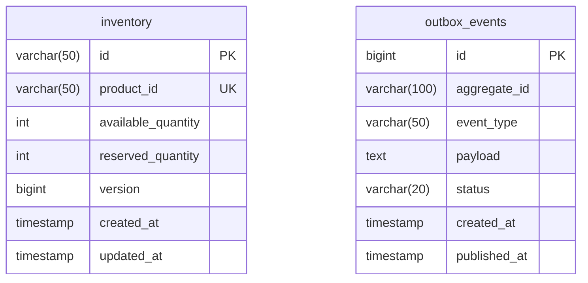
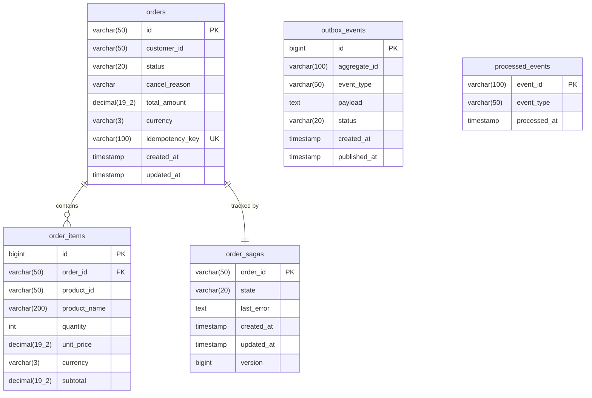
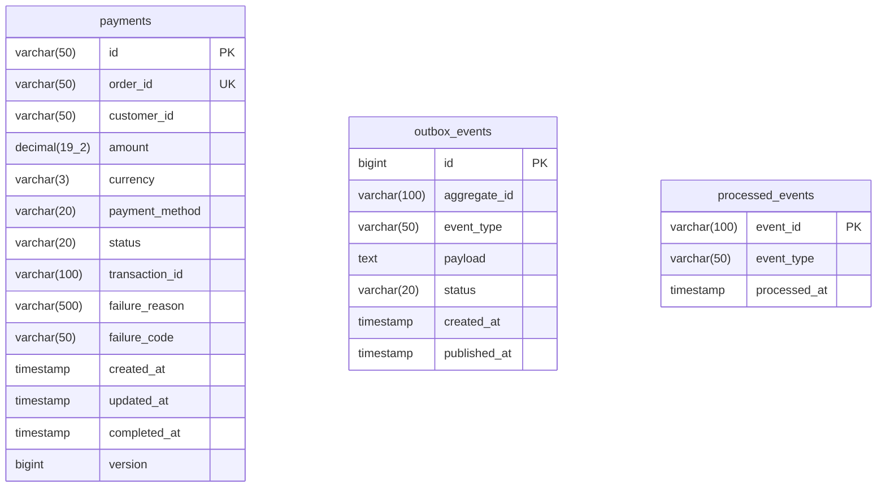
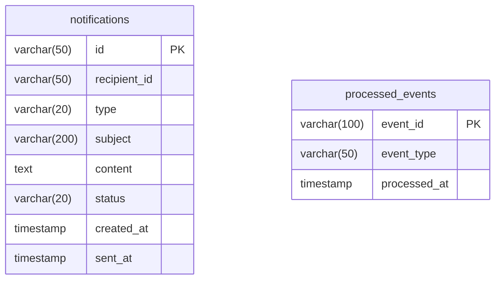
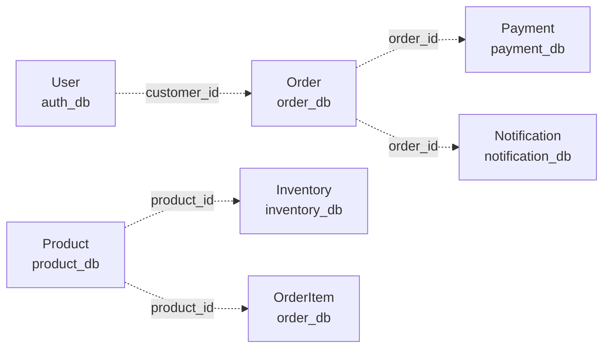
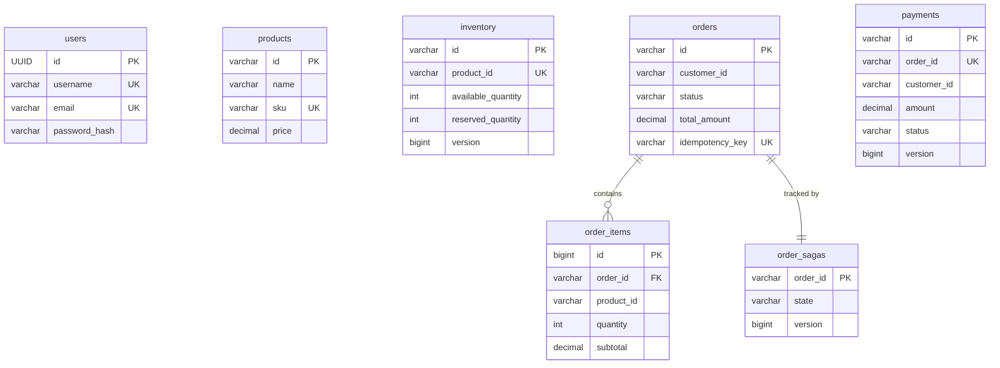

# 🗄️ Data Model & Entity Relationships

Complete database schema documentation for the E-commerce Backend microservices.

---

## Overview

### Database Architecture

The system follows the **Database per Service** pattern:

- Each microservice owns its own database
- No direct database access between services
- Data consistency achieved through **event-driven communication**
- Primary keys use **String-based IDs** (ULID format for most services, UUID for auth)

### Key Design Decisions

| Decision | Rationale |
|----------|-----------|
| **PostgreSQL** | ACID compliance, robust JSONB support, mature ecosystem |
| **ULID over UUID** | Sortable, time-ordered IDs for better indexing |
| **Optimistic Locking** | High concurrency support (inventory, payment) |
| **Audit Columns** | All tables have `created_at`, `updated_at` |
| **Outbox Pattern** | Guaranteed event delivery to Kafka |

---

## Service Databases

### 1. Auth Service Database (`auth_db`)

**Purpose**: User authentication and authorization



#### Tables

**`users`**
| Column | Type | Constraints | Description |
|--------|------|-------------|-------------|
| `id` | UUID | PK | User identifier |
| `username` | VARCHAR(50) | NOT NULL, UNIQUE | Login username |
| `email` | VARCHAR(100) | NOT NULL, UNIQUE | User email |
| `password_hash` | VARCHAR | NOT NULL | Bcrypt hashed password |
| `enabled` | BOOLEAN | NOT NULL, DEFAULT TRUE | Account status |
| `created_at` | TIMESTAMP | NOT NULL | Registration time |
| `last_login_at` | TIMESTAMP | NULL | Last login timestamp |

**Indexes**:
- `idx_username` on `username`
- `idx_email` on `email`

**`user_roles`** (Collection Table)
| Column | Type | Constraints | Description |
|--------|------|-------------|-------------|
| `user_id` | UUID | FK → users.id | User reference |
| `role` | VARCHAR(20) | NOT NULL | Role enum (CUSTOMER, ADMIN) |

**`refresh_tokens`**
| Column | Type | Constraints | Description |
|--------|------|-------------|-------------|
| `id` | BIGINT | PK, AUTO_INCREMENT | Token ID |
| `user_id` | UUID | FK → users.id | User reference |
| `token` | VARCHAR(500) | NOT NULL, UNIQUE | JWT refresh token |
| `expires_at` | TIMESTAMP | NOT NULL | Expiration time |
| `created_at` | TIMESTAMP | NOT NULL | Creation time |
| `revoked` | BOOLEAN | DEFAULT FALSE | Revocation status |

---

### 2. Product Service Database (`product_db`)

**Purpose**: Product catalog management



#### Tables

**`products`**
| Column | Type | Constraints | Description |
|--------|------|-------------|-------------|
| `id` | VARCHAR(50) | PK | Product ID (ULID) |
| `name` | VARCHAR(200) | NOT NULL | Product name |
| `description` | TEXT | NULL | Product description |
| `sku` | VARCHAR(50) | NOT NULL, UNIQUE | Stock Keeping Unit |
| `price` | DECIMAL(19,2) | NOT NULL | Product price |
| `currency` | VARCHAR(3) | NOT NULL | Currency code (USD, EUR) |
| `status` | VARCHAR(20) | NOT NULL | ACTIVE, DISCONTINUED |
| `created_at` | TIMESTAMP | NOT NULL | Creation timestamp |
| `updated_at` | TIMESTAMP | NOT NULL | Last update timestamp |

**Indexes**:
- `idx_products_sku` on `sku` (UNIQUE)
- `idx_products_status` on `status`

---

### 3. Inventory Service Database (`inventory_db`)

**Purpose**: Stock tracking and reservation



#### Tables

**`inventory`**
| Column | Type | Constraints | Description |
|--------|------|-------------|-------------|
| `id` | VARCHAR(50) | PK | Inventory ID (ULID) |
| `product_id` | VARCHAR(50) | NOT NULL, UNIQUE | Product reference |
| `available_quantity` | INT | NOT NULL | Available stock |
| `reserved_quantity` | INT | NOT NULL | Reserved for pending orders |
| `version` | BIGINT | NOT NULL | **Optimistic locking** version |
| `created_at` | TIMESTAMP | NOT NULL | Creation timestamp |
| `updated_at` | TIMESTAMP | NOT NULL | Last update timestamp |

**Indexes**:
- `idx_inventory_product_id` on `product_id` (UNIQUE)

**Optimistic Locking**:
- Uses `@Version` annotation
- Prevents lost updates in high-concurrency scenarios
- Throws `ObjectOptimisticLockingFailureException` on conflict

**`outbox_events`**
| Column | Type | Constraints | Description |
|--------|------|-------------|-------------|
| `id` | BIGINT | PK, AUTO_INCREMENT | Event ID |
| `aggregate_id` | VARCHAR(100) | NOT NULL | Entity ID (inventory ID) |
| `event_type` | VARCHAR(50) | NOT NULL | Event type (StockReserved) |
| `payload` | TEXT | NOT NULL | JSON event payload |
| `status` | VARCHAR(20) | NOT NULL | PENDING, PUBLISHED |
| `created_at` | TIMESTAMP | NOT NULL | Event creation time |
| `published_at` | TIMESTAMP | NULL | Kafka publish time |

---

### 4. Order Service Database (`order_db`)

**Purpose**: Order orchestration and saga management



#### Tables

**`orders`**
| Column | Type | Constraints | Description |
|--------|------|-------------|-------------|
| `id` | VARCHAR(50) | PK | Order ID (ULID) |
| `customer_id` | VARCHAR(50) | NOT NULL | Customer reference |
| `status` | VARCHAR(20) | NOT NULL | PENDING, CONFIRMED, CANCELLED |
| `cancel_reason` | VARCHAR | NULL | Cancellation reason |
| `total_amount` | DECIMAL(19,2) | NOT NULL | Order total |
| `currency` | VARCHAR(3) | NOT NULL | Currency code |
| `idempotency_key` | VARCHAR(100) | UNIQUE | Prevents duplicate orders |
| `created_at` | TIMESTAMP | NOT NULL | Order creation time |
| `updated_at` | TIMESTAMP | NOT NULL | Last update time |

**Indexes**:
- `idx_orders_customer_id` on `customer_id`
- `idx_orders_idempotency_key` on `idempotency_key` (UNIQUE)
- `idx_orders_status` on `status`

**`order_items`**
| Column | Type | Constraints | Description |
|--------|------|-------------|-------------|
| `id` | BIGINT | PK, AUTO_INCREMENT | Item ID |
| `order_id` | VARCHAR(50) | FK → orders.id | Order reference |
| `product_id` | VARCHAR(50) | NOT NULL | Product reference |
| `product_name` | VARCHAR(200) | NOT NULL | Product name snapshot |
| `quantity` | INT | NOT NULL | Quantity ordered |
| `unit_price` | DECIMAL(19,2) | NOT NULL | Price per unit |
| `currency` | VARCHAR(3) | NOT NULL | Currency code |
| `subtotal` | DECIMAL(19,2) | NOT NULL | Line item total |

**`order_sagas`**
| Column | Type | Constraints | Description |
|--------|------|-------------|-------------|
| `order_id` | VARCHAR(50) | PK | Order reference |
| `state` | VARCHAR(20) | NOT NULL | PENDING, INVENTORY_RESERVED, PAYMENT_COMPLETED, CONFIRMED, CANCELLED |
| `last_error` | TEXT | NULL | Last error message |
| `created_at` | TIMESTAMP | NOT NULL | Saga start time |
| `updated_at` | TIMESTAMP | NOT NULL | Last state change |
| `version` | BIGINT | NOT NULL | Optimistic locking |

**Saga States**:
1. `PENDING` → Order created, waiting for inventory
2. `INVENTORY_RESERVED` → Stock reserved, waiting for payment
3. `PAYMENT_COMPLETED` → Payment successful
4. `CONFIRMED` → Order confirmed (terminal state)
5. `CANCELLED` → Order cancelled (terminal state)

---

### 5. Payment Service Database (`payment_db`)

**Purpose**: Payment processing



#### Tables

**`payments`**
| Column | Type | Constraints | Description |
|--------|------|-------------|-------------|
| `id` | VARCHAR(50) | PK | Payment ID (ULID) |
| `order_id` | VARCHAR(50) | NOT NULL, UNIQUE | Order reference |
| `customer_id` | VARCHAR(50) | NOT NULL | Customer reference |
| `amount` | DECIMAL(19,2) | NOT NULL | Payment amount |
| `currency` | VARCHAR(3) | NOT NULL | Currency code |
| `payment_method` | VARCHAR(20) | NOT NULL | CREDIT_CARD, PAYPAL |
| `status` | VARCHAR(20) | NOT NULL | PENDING, COMPLETED, FAILED |
| `transaction_id` | VARCHAR(100) | NULL | External gateway transaction ID |
| `failure_reason` | VARCHAR(500) | NULL | Failure description |
| `failure_code` | VARCHAR(50) | NULL | Error code |
| `created_at` | TIMESTAMP | NOT NULL | Payment initiation time |
| `updated_at` | TIMESTAMP | NOT NULL | Last update time |
| `completed_at` | TIMESTAMP | NULL | Completion timestamp |
| `version` | BIGINT | NOT NULL | Optimistic locking |

---

### 6. Notification Service Database (`notification_db`)

**Purpose**: Notification tracking



#### Tables

**`notifications`**
| Column | Type | Constraints | Description |
|--------|------|-------------|-------------|
| `id` | VARCHAR(50) | PK | Notification ID (ULID) |
| `recipient_id` | VARCHAR(50) | NOT NULL | User/Customer ID |
| `type` | VARCHAR(20) | NOT NULL | EMAIL, SMS, PUSH |
| `subject` | VARCHAR(200) | NULL | Email subject |
| `content` | TEXT | NOT NULL | Notification content |
| `status` | VARCHAR(20) | NOT NULL | PENDING, SENT, FAILED |
| `created_at` | TIMESTAMP | NOT NULL | Creation time |
| `sent_at` | TIMESTAMP | NULL | Delivery time |

---

## Cross-Service Relationships

### Logical Relationships (Not Foreign Keys)

Since each service owns its database, relationships are **logical** and maintained through events:



**Key Points**:
- No database-level foreign keys across services
- References are **String IDs** stored as regular columns
- Consistency maintained through **Saga Pattern** and **Event-Driven Architecture**
- If a product is deleted, order items retain `product_name` snapshot

---

## Common Patterns

### 1. Outbox Pattern Tables

All services (except auth) have an `outbox_events` table:

```sql
CREATE TABLE outbox_events (
    id BIGSERIAL PRIMARY KEY,
    aggregate_id VARCHAR(100) NOT NULL,
    event_type VARCHAR(50) NOT NULL,
    payload TEXT NOT NULL,
    status VARCHAR(20) NOT NULL DEFAULT 'PENDING',
    created_at TIMESTAMP NOT NULL DEFAULT NOW(),
    published_at TIMESTAMP
);

CREATE INDEX idx_outbox_status ON outbox_events(status);
```

**Purpose**: Guarantee event delivery to Kafka using transactional outbox pattern.

### 2. Processed Events (Idempotency)

Consumer services have `processed_events` table:

```sql
CREATE TABLE processed_events (
    event_id VARCHAR(100) PRIMARY KEY,
    event_type VARCHAR(50) NOT NULL,
    processed_at TIMESTAMP NOT NULL DEFAULT NOW()
);
```

**Purpose**: Prevent duplicate event processing (idempotency).

### 3. Audit Columns

All domain tables have:
- `created_at TIMESTAMP NOT NULL`
- `updated_at TIMESTAMP NOT NULL`

Managed by JPA lifecycle hooks (`@PrePersist`, `@PreUpdate`).

### 4. Optimistic Locking

High-concurrency tables use `@Version`:
- `inventory.version`
- `payment.version`
- `order_sagas.version`

---

## Database Migrations

### Flyway Migration Files

Located in each service: `src/main/resources/db/migration/`

**Naming Convention**:
```
V1__initial_schema.sql
V2__add_idempotency_key.sql
V3__add_indexes.sql
```

**Example Migration**:
```sql
-- V1__initial_schema.sql
CREATE TABLE products (
    id VARCHAR(50) PRIMARY KEY,
    name VARCHAR(200) NOT NULL,
    sku VARCHAR(50) NOT NULL UNIQUE,
    price DECIMAL(19,2) NOT NULL,
    currency VARCHAR(3) NOT NULL,
    status VARCHAR(20) NOT NULL,
    created_at TIMESTAMP NOT NULL,
    updated_at TIMESTAMP NOT NULL
);

CREATE INDEX idx_products_sku ON products(sku);
CREATE INDEX idx_products_status ON products(status);
```

---

## Performance Considerations

### Indexing Strategy

| Index Type | Use Case | Example |
|------------|----------|---------|
| **Unique** | Enforce uniqueness | `products.sku`, `orders.idempotency_key` |
| **Single Column** | Frequent WHERE clauses | `orders.customer_id`, `orders.status` |
| **Composite** | Multi-column queries | (Future: `orders(customer_id, status)`) |

### Query Optimization

- **Use indexes** for all foreign key references
- **Avoid N+1 queries**: Use `@OneToMany` with `JOIN FETCH`
- **Pagination**: Always use `LIMIT` and `OFFSET` for large result sets
- **Connection Pooling**: HikariCP configured with optimal pool size

---

## Security

### Sensitive Data

| Table | Column | Protection |
|-------|--------|------------|
| `users` | `password_hash` | Bcrypt hashed (cost factor 12) |
| `refresh_tokens` | `token` | JWT, stored hashed |
| `payments` | `transaction_id` | Encrypted at rest (future) |

### Access Control

- **Database users**: Each service has dedicated DB user with minimal privileges
- **No shared credentials** across services
- **Read-only replicas** for reporting (future)

---

## Backup & Recovery

### Backup Strategy

- **Full backup**: Daily at 2 AM UTC
- **Incremental backup**: Every 6 hours
- **WAL archiving**: Continuous
- **Retention**: 30 days

### Recovery Procedures

See [Disaster Recovery Runbook](../runbooks/disaster-recovery.md)

---

## Next Steps

- [System Architecture Overview](system-overview.md) - Understand service interactions
- [Order Saga Flow](order-saga-flow.md) - See how data flows across services
- [Outbox Pattern](outbox-pattern.md) - Event delivery guarantees
- [API Documentation](../api/README.md) - REST API contracts

---

## Appendix: Full Schema Diagrams

### Complete System ERD



---

**Document Version**: 1.0  
**Last Updated**: 2026-01-19  
**Maintained By**: Solution Architect
