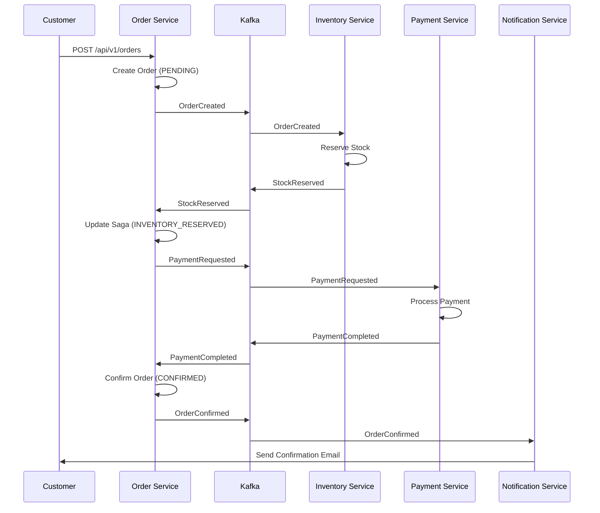
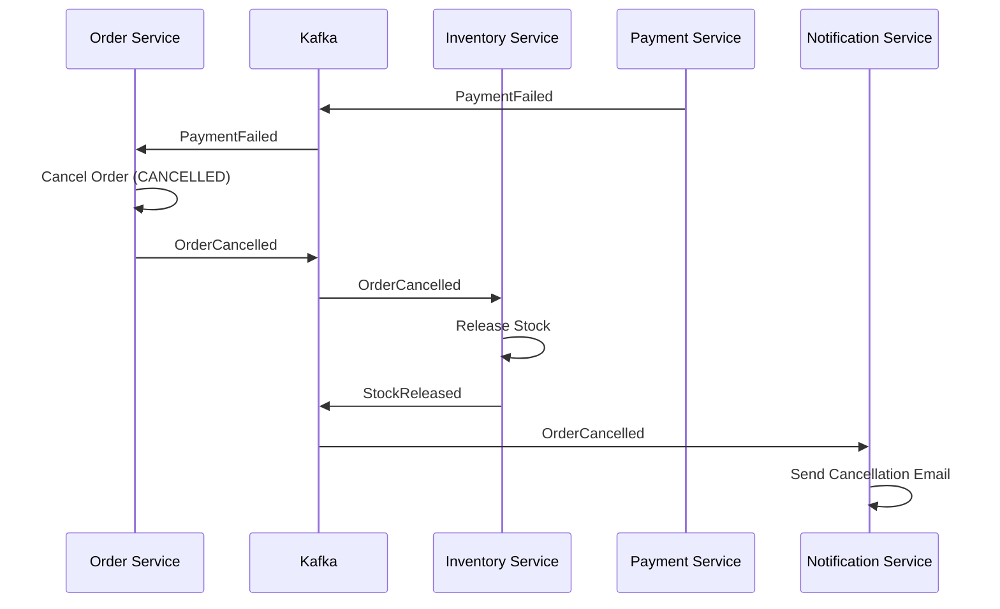

# 📡 Event Catalog

Complete reference for all domain events in the E-commerce Backend event-driven architecture.

---

## Overview

### Event-Driven Architecture

The system uses **Apache Kafka** for asynchronous communication between microservices. Events are published using the **Transactional Outbox Pattern** to guarantee delivery.

### Event Design Principles

- **Immutable**: Events cannot be modified after creation
- **Self-contained**: Events carry all necessary data
- **Versioned**: Events include schema version for evolution
- **Idempotent**: Consumers can safely process events multiple times

### Event Structure

All events implement `DomainEvent` interface:

```java
public interface DomainEvent {
    String eventId();      // Unique event identifier (UUID)
    Instant occurredAt();  // When the event occurred
}
```

---

## Kafka Topics

| Topic | Partition Strategy | Retention | Replication Factor |
|-------|-------------------|-----------|-------------------|
| `order-events` | By `orderId` | 7 days | 3 |
| `inventory-events` | By `productId` | 7 days | 3 |
| `payment-events` | By `orderId` | 30 days | 3 |
| `notification-events` | By `recipientId` | 3 days | 3 |

---

## Order Events

**Topic**: `order-events`  
**Producer**: Order Service  
**Consumers**: Inventory Service, Payment Service, Notification Service

### OrderCreated

Published when a new order is created and enters PENDING status.

**Schema**:
```json
{
  "eventId": "550e8400-e29b-41d4-a716-446655440000",
  "occurredAt": "2026-01-19T10:15:30Z",
  "orderId": "01HQZX3Y4Z5A6B7C8D9E0F1G2H",
  "customerId": "customer-123",
  "items": [
    {
      "productId": "01HQZY5Z6A7B8C9D0E1F2G3H4I",
      "productName": "Laptop Pro 15",
      "quantity": 2,
      "unitPrice": 1299.99,
      "currency": "USD"
    }
  ],
  "totalAmount": 2599.98,
  "currency": "USD",
  "idempotencyKey": "01HQZZ7A8B9C0D1E2F3G4H5I6J"
}
```

**Fields**:
| Field | Type | Description |
|-------|------|-------------|
| `eventId` | String (UUID) | Unique event identifier |
| `occurredAt` | Instant | Event timestamp |
| `orderId` | String (ULID) | Order identifier |
| `customerId` | String | Customer identifier |
| `items` | Array | Order line items |
| `totalAmount` | BigDecimal | Total order amount |
| `currency` | String | Currency code (ISO 4217) |
| `idempotencyKey` | String | Idempotency key from request |

**Triggers**:
- Customer submits order via `POST /api/v1/orders`

**Consumers**:
- **Inventory Service**: Reserves stock for each item
- **Notification Service**: Sends order confirmation email

**Saga State Transition**:
```
PENDING (initial state)
```

---

### OrderConfirmed

Published when an order is fully confirmed (payment successful).

**Schema**:
```json
{
  "eventId": "660e8400-e29b-41d4-a716-446655440001",
  "occurredAt": "2026-01-19T10:16:00Z",
  "orderId": "01HQZX3Y4Z5A6B7C8D9E0F1G2H",
  "customerId": "customer-123",
  "totalAmount": 2599.98,
  "currency": "USD"
}
```

**Fields**:
| Field | Type | Description |
|-------|------|-------------|
| `eventId` | String (UUID) | Unique event identifier |
| `occurredAt` | Instant | Event timestamp |
| `orderId` | String (ULID) | Order identifier |
| `customerId` | String | Customer identifier |
| `totalAmount` | BigDecimal | Total order amount |
| `currency` | String | Currency code |

**Triggers**:
- Order Service receives `PaymentCompleted` event

**Consumers**:
- **Notification Service**: Sends order confirmation email

**Saga State Transition**:
```
PAYMENT_COMPLETED → CONFIRMED (terminal state)
```

---

### OrderCancelled

Published when an order is cancelled.

**Schema**:
```json
{
  "eventId": "770e8400-e29b-41d4-a716-446655440002",
  "occurredAt": "2026-01-19T10:17:00Z",
  "orderId": "01HQZX3Y4Z5A6B7C8D9E0F1G2H",
  "customerId": "customer-123",
  "reason": "Payment failed",
  "requiresRefund": false
}
```

**Fields**:
| Field | Type | Description |
|-------|------|-------------|
| `eventId` | String (UUID) | Unique event identifier |
| `occurredAt` | Instant | Event timestamp |
| `orderId` | String (ULID) | Order identifier |
| `customerId` | String | Customer identifier |
| `reason` | String | Cancellation reason |
| `requiresRefund` | Boolean | Whether refund is needed |

**Triggers**:
- Customer cancels order via `POST /api/v1/orders/{id}/cancel`
- Payment fails (compensation flow)
- Stock reservation fails (compensation flow)

**Consumers**:
- **Inventory Service**: Releases reserved stock
- **Payment Service**: Processes refund (if `requiresRefund=true`)
- **Notification Service**: Sends cancellation email

**Saga State Transition**:
```
ANY_STATE → CANCELLED (terminal state)
```

---

## Inventory Events

**Topic**: `inventory-events`  
**Producer**: Inventory Service  
**Consumers**: Order Service

### StockReserved

Published when stock is successfully reserved for an order.

**Schema**:
```json
{
  "eventId": "880e8400-e29b-41d4-a716-446655440003",
  "occurredAt": "2026-01-19T10:15:35Z",
  "productId": "01HQZY5Z6A7B8C9D0E1F2G3H4I",
  "orderId": "01HQZX3Y4Z5A6B7C8D9E0F1G2H",
  "quantity": 2,
  "remainingAvailable": 48
}
```

**Fields**:
| Field | Type | Description |
|-------|------|-------------|
| `eventId` | String (UUID) | Unique event identifier |
| `occurredAt` | Instant | Event timestamp |
| `productId` | String (ULID) | Product identifier |
| `orderId` | String (ULID) | Order identifier |
| `quantity` | Integer | Quantity reserved |
| `remainingAvailable` | Integer | Remaining available stock |

**Triggers**:
- Inventory Service consumes `OrderCreated` event

**Consumers**:
- **Order Service**: Updates saga state

**Saga State Transition**:
```
PENDING → INVENTORY_RESERVED
```

---

### StockReservationFailed

Published when stock reservation fails (insufficient stock).

**Schema**:
```json
{
  "eventId": "990e8400-e29b-41d4-a716-446655440004",
  "occurredAt": "2026-01-19T10:15:35Z",
  "productId": "01HQZY5Z6A7B8C9D0E1F2G3H4I",
  "orderId": "01HQZX3Y4Z5A6B7C8D9E0F1G2H",
  "requestedQuantity": 100,
  "availableQuantity": 50,
  "reason": "Insufficient stock"
}
```

**Fields**:
| Field | Type | Description |
|-------|------|-------------|
| `eventId` | String (UUID) | Unique event identifier |
| `occurredAt` | Instant | Event timestamp |
| `productId` | String (ULID) | Product identifier |
| `orderId` | String (ULID) | Order identifier |
| `requestedQuantity` | Integer | Requested quantity |
| `availableQuantity` | Integer | Available quantity |
| `reason` | String | Failure reason |

**Triggers**:
- Inventory Service cannot reserve sufficient stock

**Consumers**:
- **Order Service**: Triggers compensation (cancels order)

**Saga State Transition**:
```
PENDING → CANCELLED (compensation)
```

---

### StockReleased

Published when reserved stock is released (order cancelled/failed).

**Schema**:
```json
{
  "eventId": "aa0e8400-e29b-41d4-a716-446655440005",
  "occurredAt": "2026-01-19T10:17:05Z",
  "productId": "01HQZY5Z6A7B8C9D0E1F2G3H4I",
  "orderId": "01HQZX3Y4Z5A6B7C8D9E0F1G2H",
  "quantity": 2,
  "newAvailable": 50
}
```

**Fields**:
| Field | Type | Description |
|-------|------|-------------|
| `eventId` | String (UUID) | Unique event identifier |
| `occurredAt` | Instant | Event timestamp |
| `productId` | String (ULID) | Product identifier |
| `orderId` | String (ULID) | Order identifier |
| `quantity` | Integer | Quantity released |
| `newAvailable` | Integer | New available stock |

**Triggers**:
- Inventory Service consumes `OrderCancelled` event

**Consumers**:
- None (informational event)

---

### AllItemsReserved

Published when all items in an order have been successfully reserved.

**Schema**:
```json
{
  "eventId": "bb0e8400-e29b-41d4-a716-446655440006",
  "occurredAt": "2026-01-19T10:15:40Z",
  "productId": null,
  "orderId": "01HQZX3Y4Z5A6B7C8D9E0F1G2H"
}
```

**Fields**:
| Field | Type | Description |
|-------|------|-------------|
| `eventId` | String (UUID) | Unique event identifier |
| `occurredAt` | Instant | Event timestamp |
| `productId` | String | Always null (composite event) |
| `orderId` | String (ULID) | Order identifier |

**Triggers**:
- All `StockReserved` events received for order

**Consumers**:
- **Order Service**: Proceeds to payment

---

## Payment Events

**Topic**: `payment-events`  
**Producer**: Payment Service, Order Service  
**Consumers**: Order Service, Notification Service

### PaymentRequested

Published by Order Service when payment is requested.

**Schema**:
```json
{
  "eventId": "cc0e8400-e29b-41d4-a716-446655440007",
  "occurredAt": "2026-01-19T10:15:45Z",
  "paymentId": "dd0e8400-e29b-41d4-a716-446655440008",
  "orderId": "01HQZX3Y4Z5A6B7C8D9E0F1G2H",
  "customerId": "customer-123",
  "amount": 2599.98,
  "currency": "USD"
}
```

**Fields**:
| Field | Type | Description |
|-------|------|-------------|
| `eventId` | String (UUID) | Unique event identifier |
| `occurredAt` | Instant | Event timestamp |
| `paymentId` | String (UUID) | Payment identifier |
| `orderId` | String (ULID) | Order identifier |
| `customerId` | String | Customer identifier |
| `amount` | BigDecimal | Payment amount |
| `currency` | String | Currency code |

**Triggers**:
- Order Service receives `AllItemsReserved` event

**Consumers**:
- **Payment Service**: Processes payment

---

### PaymentCompleted

Published when payment is successfully processed.

**Schema**:
```json
{
  "eventId": "ee0e8400-e29b-41d4-a716-446655440009",
  "occurredAt": "2026-01-19T10:15:50Z",
  "paymentId": "dd0e8400-e29b-41d4-a716-446655440008",
  "orderId": "01HQZX3Y4Z5A6B7C8D9E0F1G2H",
  "customerId": "customer-123",
  "amount": 2599.98,
  "currency": "USD",
  "transactionId": "TXN-2026-01-19-12345"
}
```

**Fields**:
| Field | Type | Description |
|-------|------|-------------|
| `eventId` | String (UUID) | Unique event identifier |
| `occurredAt` | Instant | Event timestamp |
| `paymentId` | String (UUID) | Payment identifier |
| `orderId` | String (ULID) | Order identifier |
| `customerId` | String | Customer identifier |
| `amount` | BigDecimal | Payment amount |
| `currency` | String | Currency code |
| `transactionId` | String | External gateway transaction ID |

**Triggers**:
- Payment Service successfully processes payment

**Consumers**:
- **Order Service**: Confirms order
- **Notification Service**: Sends payment receipt

**Saga State Transition**:
```
INVENTORY_RESERVED → PAYMENT_COMPLETED
```

---

### PaymentFailed

Published when payment processing fails.

**Schema**:
```json
{
  "eventId": "ff0e8400-e29b-41d4-a716-446655440010",
  "occurredAt": "2026-01-19T10:15:50Z",
  "paymentId": "dd0e8400-e29b-41d4-a716-446655440008",
  "orderId": "01HQZX3Y4Z5A6B7C8D9E0F1G2H",
  "customerId": "customer-123",
  "reason": "Insufficient funds",
  "errorCode": "INSUFFICIENT_FUNDS"
}
```

**Fields**:
| Field | Type | Description |
|-------|------|-------------|
| `eventId` | String (UUID) | Unique event identifier |
| `occurredAt` | Instant | Event timestamp |
| `paymentId` | String (UUID) | Payment identifier |
| `orderId` | String (ULID) | Order identifier |
| `customerId` | String | Customer identifier |
| `reason` | String | Failure reason |
| `errorCode` | String | Error code |

**Triggers**:
- Payment Service fails to process payment

**Consumers**:
- **Order Service**: Triggers compensation (cancels order, releases stock)
- **Notification Service**: Sends payment failure email

**Saga State Transition**:
```
INVENTORY_RESERVED → CANCELLED (compensation)
```

---

### PaymentRefunded

Published when a payment is refunded.

**Schema**:
```json
{
  "eventId": "000e8400-e29b-41d4-a716-446655440011",
  "occurredAt": "2026-01-19T10:18:00Z",
  "paymentId": "dd0e8400-e29b-41d4-a716-446655440008",
  "orderId": "01HQZX3Y4Z5A6B7C8D9E0F1G2H",
  "amount": 2599.98,
  "reason": "Customer requested cancellation"
}
```

**Fields**:
| Field | Type | Description |
|-------|------|-------------|
| `eventId` | String (UUID) | Unique event identifier |
| `occurredAt` | Instant | Event timestamp |
| `paymentId` | String (UUID) | Payment identifier |
| `orderId` | String (ULID) | Order identifier |
| `amount` | BigDecimal | Refund amount |
| `reason` | String | Refund reason |

**Triggers**:
- Payment Service processes refund for cancelled order

**Consumers**:
- **Notification Service**: Sends refund confirmation email

---

## Event Flow Diagrams

### Happy Path: Order Creation



### Compensation Flow: Payment Failed



---

## Consumer Configuration

### Idempotency

All consumers use `processed_events` table to ensure idempotent processing:

```sql
CREATE TABLE processed_events (
    event_id VARCHAR(100) PRIMARY KEY,
    event_type VARCHAR(50) NOT NULL,
    processed_at TIMESTAMP NOT NULL DEFAULT NOW()
);
```

**Processing Logic**:
```java
@KafkaListener(topics = "order-events")
public void handleOrderEvent(OrderEvents event) {
    // Check if already processed
    if (processedEventRepository.existsById(event.eventId())) {
        log.info("Event {} already processed, skipping", event.eventId());
        return;
    }
    
    // Process event
    processEvent(event);
    
    // Mark as processed
    processedEventRepository.save(new ProcessedEvent(event.eventId(), event.getClass().getSimpleName()));
}
```

### Error Handling

**Retry Strategy**:
- Transient errors: Retry with exponential backoff (max 3 attempts)
- Permanent errors: Move to Dead Letter Queue (DLQ)

**Dead Letter Queue**:
```yaml
spring:
  kafka:
    consumer:
      properties:
        max.poll.interval.ms: 300000  # 5 minutes
    listener:
      ack-mode: manual
```

---

## Monitoring Events

### Kafka UI

Access: http://localhost:8090

**Features**:
- View topics and messages
- Monitor consumer lag
- Inspect message payloads

### Prometheus Metrics

```promql
# Consumer lag
kafka_consumer_lag{topic="order-events"}

# Messages consumed
rate(kafka_consumer_records_consumed_total[5m])

# Processing errors
rate(kafka_consumer_errors_total[5m])
```

---

## Event Versioning

### Schema Evolution

**Backward Compatible Changes** (allowed):
- Add optional fields
- Add new event types

**Breaking Changes** (requires new version):
- Remove fields
- Change field types
- Rename fields

**Example**:
```java
// v1
record OrderCreated(String eventId, Instant occurredAt, String orderId, ...) {}

// v2 (backward compatible)
record OrderCreated(
    String eventId, 
    Instant occurredAt, 
    String orderId, 
    ...,
    String promotionCode  // New optional field
) {}
```

---

## Next Steps

- [Order Saga Flow](order-saga-flow.md) - Detailed saga orchestration
- [Outbox Pattern](outbox-pattern.md) - Reliable event delivery
- [System Overview](system-overview.md) - Architecture context
- [Troubleshooting](../TROUBLESHOOTING.md) - Event-related issues

---

**Document Version**: 1.0  
**Last Updated**: 2026-01-19  
**Maintained By**: Backend Team
