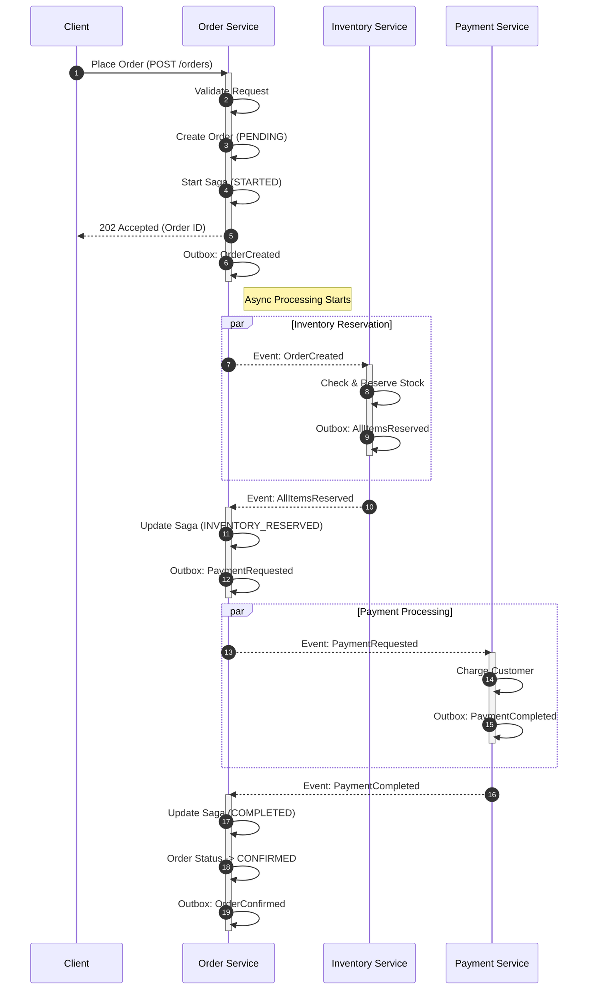
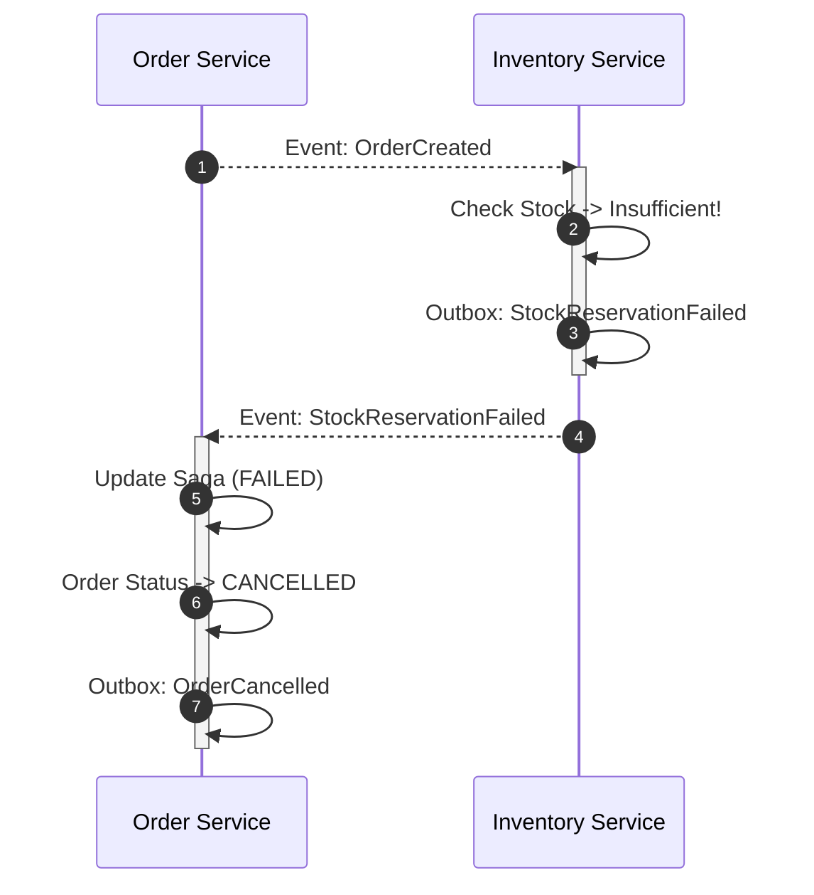
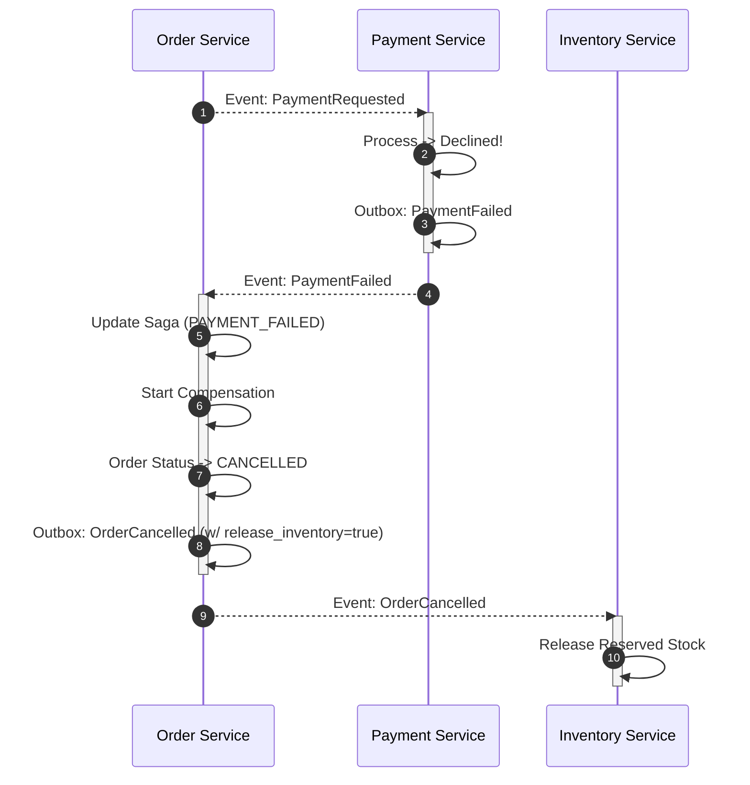

# 🔄 Order Saga & State Management

This document details the **Order Saga**, a sequence of local transactions that coordinates the order fulfillment process across the **Order**, **Inventory**, and **Payment** services.

## 🚦 Order State Machine

The central source of truth for an order's lifecycle is the `Order` aggregate in the Order Service.

stateDiagram-v2
    [*] --> STARTED: Create Order
    
    STARTED --> INVENTORY_RESERVED: Inventory Reserved
    STARTED --> INVENTORY_FAILED: Out of Stock
    
    INVENTORY_RESERVED --> PAYMENT_COMPLETED: Payment Success
    INVENTORY_RESERVED --> PAYMENT_FAILED: Payment Declined
    
    PAYMENT_COMPLETED --> COMPLETED: Order Confirmed
    
    INVENTORY_FAILED --> COMPENSATING: Start Compensation
    PAYMENT_FAILED --> COMPENSATING: Start Compensation
    
    COMPENSATING --> COMPENSATED: Compensation Logic Done
    COMPENSATING --> FAILED: Compensation Failed (Manual Fix)
    
    COMPENSATED --> [*]
    COMPLETED --> [*]
    FAILED --> [*]

---

## 🔁 Saga Choreography Flow

We utilize a **Hybrid Choreography** approach where the `OrderService` acts as the primary coordinator (Orchestrator for its own saga state), but services react to events (Choreography) to reduce tight coupling.

### 1. Happy Path (Success)

---

### 2. Failure Path: Out of Stock (Compensation)

If the inventory service cannot reserve items, the order must be cancelled immediately.

---

### 3. Failure Path: Payment Failed (Compensation)

If payment fails, we must *rollback* the inventory reservation.

---

## 🗃️ Saga Data Model

The `OrderSaga` entity persists the state of the transaction to survive system restarts.

| Field | Type | Description |
| :--- | :--- | :--- |
| `sagaId` | UUID | Unique identifier for the saga (usually same as OrderId) |
| `status` | Enum | `STARTED`, `INVENTORY_RESERVED`, `PAYMENT_COMPLETED`, `COMPLETED`, `FAILED`, `CANCELLED` |
| `history` | List | Audit log of state transitions (Optional) |
| `createdAt` | Timestamp | Start time |
| `updatedAt` | Timestamp | Last update time |

## 🛡️ Reliability Guarantees

*   **Atomic State Updates**: Saga state updates happen in the same transaction as event processing.
*   **Duplicate Event Protection**: All consumers use `IdempotentEventHandler` to ignore re-delivered events.
*   **No Lost Events**: The **Transactional Outbox** ensures that if a step completes, the next event is guaranteed to be published.
