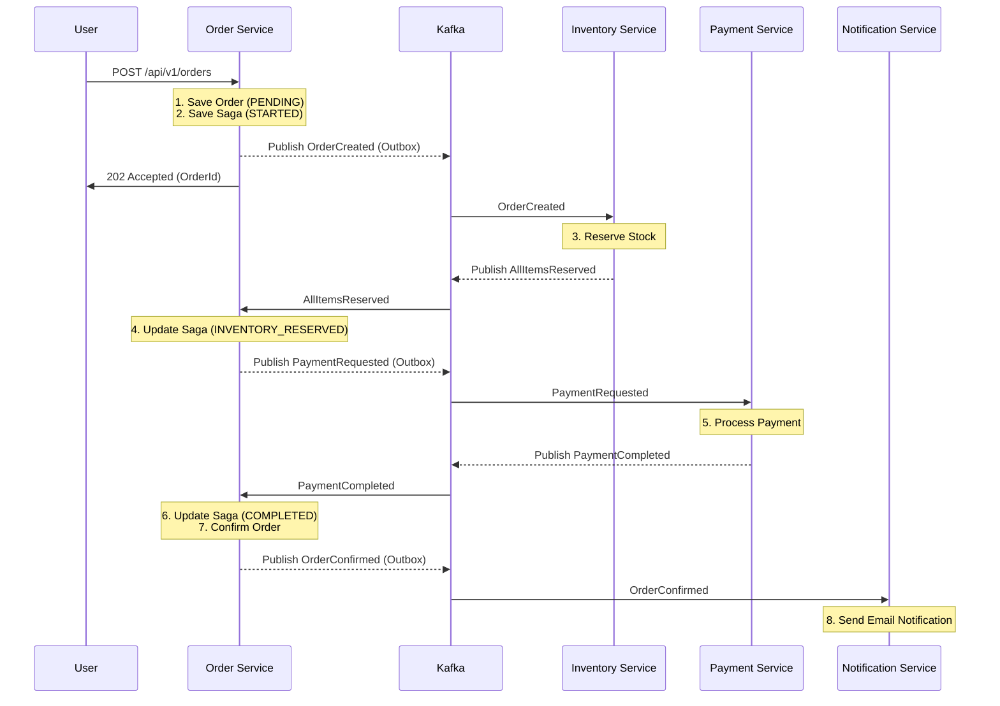

# Order Creation Saga Flow

The platform uses a **Saga Pattern** (Choreography/Orchestration mix) to manage distributed transactions across microservices.

## 🚀 Happy Path Flow

The diagram below shows the sequence of events during a successful order creation.

## 🛠️ State Management

The `OrderSaga` in the Order Service tracks the progress of each order:

*   **STARTED**: Initial state after receiving the order request.
*   **INVENTORY_RESERVED**: Stock has been successfully allocated.
*   **PAYMENT_COMPLETED**: Funds have been successfully processed.
*   **COMPLETED**: All steps finished successfully.
*   **FAILED**: Something went wrong, triggering compensation or cancellation.

## 🔄 Compensation Flows

If a step fails, the system triggers compensating transactions:

1.  **Inventory Failed**: If stock cannot be reserved, the Order Service cancels the order.
2.  **Payment Failed**: If payment fails, the Order Service:
    *   Publishes a compensation event to Release Inventory.
    *   Cancels the Order.
