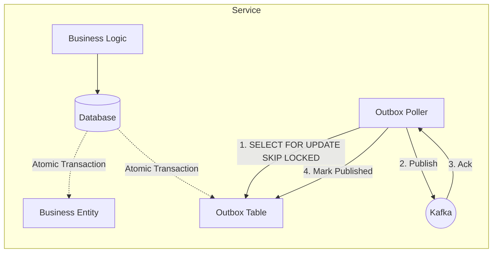

# Transactional Outbox Pattern

To ensure reliable communication between microservices, we implement the **Transactional Outbox Pattern**. This guarantees **at-least-once delivery** of events even in the face of partial system failures.

## ❓ Problem

Updating a database and publishing a message to Kafka are two separate operations. If the database update succeeds but the message publication fails (e.g., network timeout), the system becomes inconsistent.

## ✅ Solution

Instead of publishing directly to Kafka, we save the event payload into an **Outbox Table** within the same database transaction as the business entity update.



## 🛠️ Implementation Details

### 1. Database Transaction
The `OutboxEventPublisher` (shared in `common-lib`) is called within a `@Transactional` boundary:

```java
@Transactional
public void process() {
    // 1. Mutate business state
    repository.save(entity);
    
    // 2. Save event to outbox (same transaction)
    outboxPublisher.publish("AggregateType", id, event);
}
```

### 2. Reliable Polling
The `OutboxPoller` runs a scheduled job that:
- Uses `SELECT ... FOR UPDATE SKIP LOCKED` (PostgreSQL) to safely fetch messages in a distributed environment without blocking other instances.
- Publishes to Kafka with producer acknowledgments (`acks=all`).
- Only marks messages as `published = true` after receiving a successful acknowledgment from Kafka.

### 3. Idempotent Consumers
Since the poller provides *at-least-once* delivery, consumers might receive duplicate messages. To handle this, we use the `IdempotentEventHandler` (in `common-lib`) which tracks processed `eventId`s in a dedicated table.
