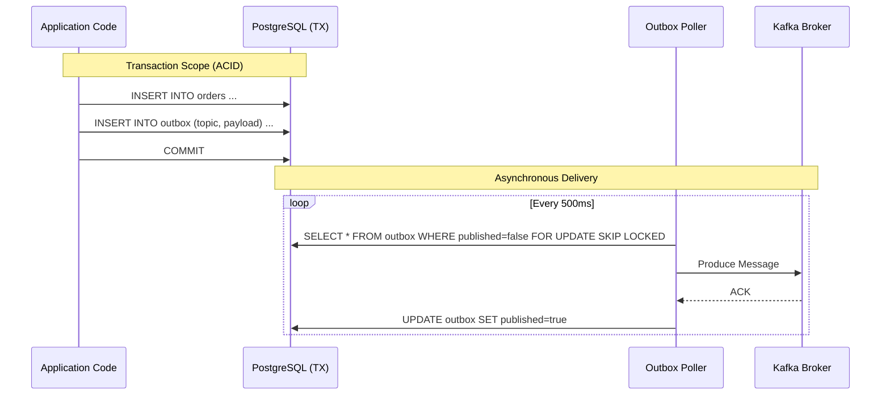

# 📤 Transactional Outbox Pattern

The **Transactional Outbox Pattern** is the backbone of data integrity in our distributed system. It solves the dual-write problem where an application needs to update a database and send a message to a queue without using distributed transactions (2PC/XA).

## ❓ The Problem: Dual Writes

Imagine this common scenario code:

```java
@Transactional
public void placeOrder(Order order) {
    repository.save(order);       // 1. Write to DB
    kafkaTemplate.send(event);    // 2. Write to Network (Kafka)
}
```

*   **Scenario A**: DB commit fails. Easy, rollback. Kafka send never happens.
*   **Scenario B**: DB commit succeeds, but `kafkaTemplate.send` crashes (network, broker down). **Data Inconsistency!** We have an order but no event for Inventory/Payment.
*   **Scenario C**: Kafka send succeeds, but DB commit (unexpectedly) fails afterward. **Ghost Message!** Downstream systems process an order that doesn't exist.

## ✅ The Solution: Outbox Table

We treat the event *as data* and save it to the same database in the same transaction.



---

## 💻 Tech Implementation

### 1. Database Schema
table: `outbox`

| Column | Type | Description |
| :--- | :--- | :--- |
| `id` | UUID | Primary Key |
| `aggregate_type` | VARCHAR | e.g., "Order", "Product" |
| `aggregate_id` | VARCHAR | ID of the entity |
| `type` | VARCHAR | Event Class Name (e.g., "OrderCreated") |
| `payload` | JSONB | The actual event data |
| `created_at` | TIMESTAMP | When it happened |
| `published` | BOOLEAN | Delivery status |

### 2. The Publisher code
The shared `OutboxEventPublisher` simplifies the usage for developers:

```java
// Logic inside OrderService.createOrder()
@Transactional
public void createOrder(Cmd command) {
    Order order = Order.create(command);
    repository.save(order); // DB Write 1
    
    // DB Write 2 (The Event)
    eventPublisher.publish("Order", order.getId().toString(), new OrderCreated(...));
}
```

### 3. The Poller (Locking Strategy)
To ensure we can run multiple instances of the service without duplicate processing, we use Postgres specific locking:

```sql
SELECT * FROM outbox 
WHERE published = false 
ORDER BY created_at ASC 
LIMIT 50 
FOR UPDATE SKIP LOCKED;
```

*   **FOR UPDATE**: Locks the rows.
*   **SKIP LOCKED**: If another instance locked rows 1-50, this query instantly returns rows 51-100 without waiting. This allows high parallel throughput.

---

## 📈 Benefits

1.  **Guaranteed Delivery**: Events are never lost as long as the DB is persistent.
2.  **Causal Ordering**: Events are stored in order. The poller respects insertion order.
3.  **Resilience**: If Kafka is down, events just pile up in the DB. Once Kafka returns, they flush automatically.
4.  **Simplicity**: No need for complex XA transaction managers.
