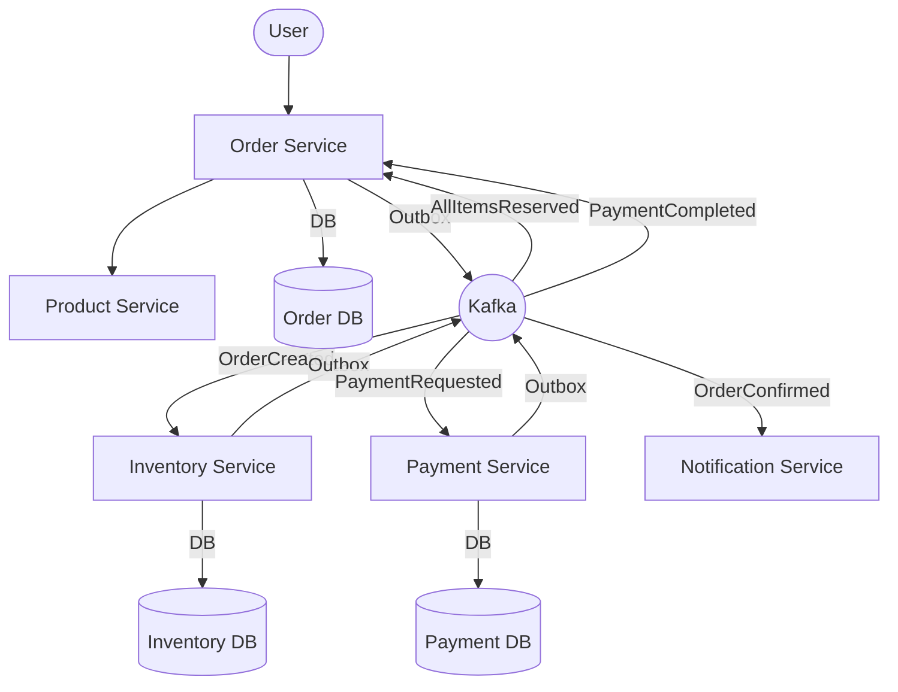

# System Overview

The platform is built using a microservices architecture with a combination of synchronous REST APIs and asynchronous event-driven communication.

## 🏗️ Service Architecture

Each microservice follows **Hexagonal Architecture** (Ports & Adapters) with a clean separation between domain logic and infrastructure.

## 📋 Services Roles

| Service | Responsibility | Communication |
|---------|----------------|---------------|
| **Order Service** | Orchestrates the order lifecycle and Saga state. | REST (to Product), Kafka (Events) |
| **Product Service** | Manages product catalog and pricing. | REST (Provider) |
| **Inventory Service** | Manages stock levels and temporary reservations. | Kafka (Consumer/Producer) |
| **Payment Service** | Interface with payment gateways and manage payment state. | Kafka (Consumer/Producer) |
| **Notification Service** | Sends emails and alerts to customers. | Kafka (Consumer) |

## 📡 Communication Patterns

1.  **Synchronous (REST)**: Used for real-time reads (e.g., Order Service checking Product availability during creation).
2.  **Asynchronous (Kafka)**: Used for state transitions and side effects (e.g., Inventory reservation, Payment processing, Notifications).
3.  **Transactional Outbox**: Ensures reliable event delivery by saving events in the same database transaction as business logic.
