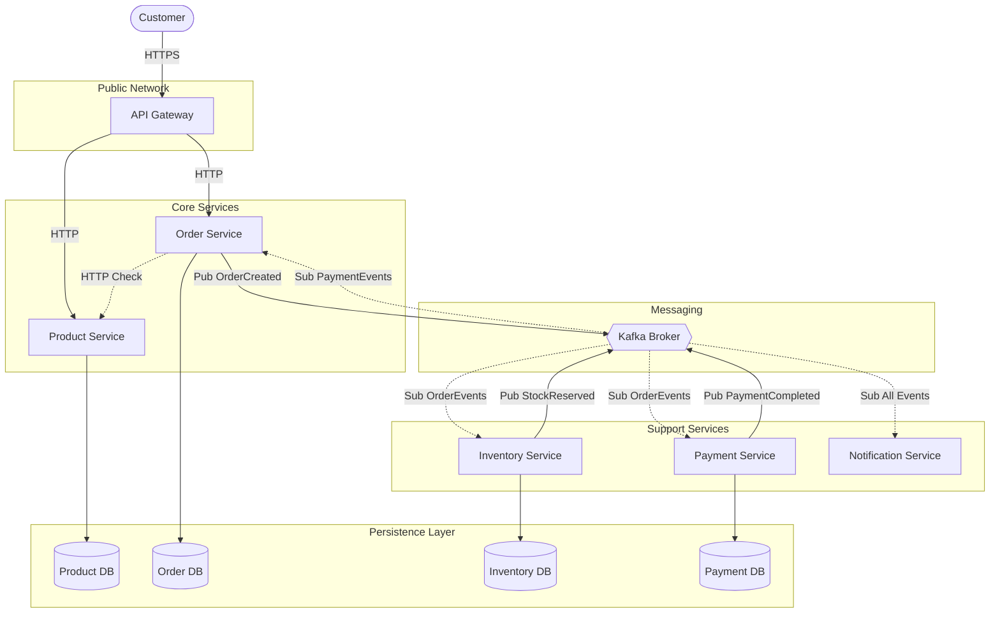
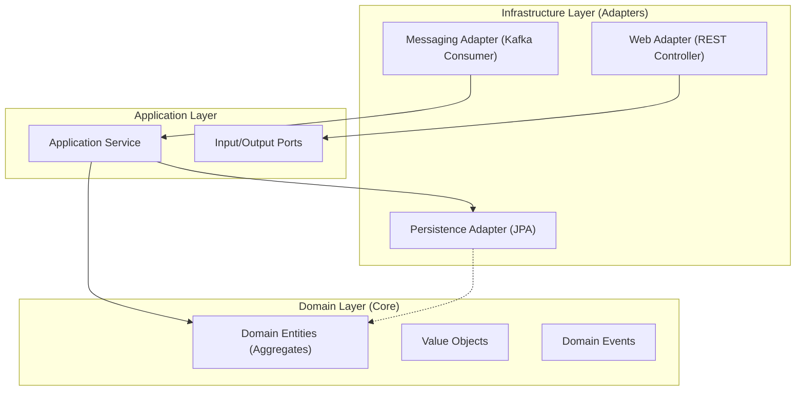

# 🏗️ System Architecture Overview

This document provides a comprehensive high-level view of the E-commerce Platform's architecture. It is designed to help developers understand the system's structure, communication patterns, and key design decisions.

## 🌟 Architectural Style

The system adopts a **Microservices Architecture** with **Event-Driven** communication, aiming for high scalability, loose coupling, and independent deployability.

### Key Patterns used:
*   **Hexagonal Architecture (Ports & Adapters)**: Ensures the core domain logic remains isolated from external infrastructure (Database, API, Messaging).
*   **Domain-Driven Design (DDD)**: The system is modeled around business domains (Order, Product, Inventory, etc.).
*   **CQRS (Lite)**: Separation of command (state change) and query models where necessary.
*   **Saga Pattern**: Manages distributed transactions across services.
*   **Transactional Outbox**: Guarantees data consistency between the database and the message broker.

---

## 🧩 Service Map (Container Diagram)

The following diagram illustrates the high-level containers and their interactions.

---

## 🏛️ Internal Service Design (Hexagonal)

Every microservice implements **Hexagonal Architecture** to keep the business logic pure.

*   **Domain Layer**: Pure Java code. No Spring annotations (except maybe minimal DI if needed), no Hibernate/JPA annotations. Contains Business Rules.
*   **Application Layer**: Orchestrators. They handle transactions, security checks, and coordinate between the Domain and Infrastructure.
*   **Infrastructure Layer**: The "dirty" details. JPA Repositories, REST Controllers, Kafka Listeners.

---

## 📡 Technology Stack Deep Dive

| Component | Technology | Reasoning |
| :--- | :--- | :--- |
| **Language** | **Java 21** | LTS version, Records, Pattern Matching, Virtual Threads |
| **Framework** | **Spring Boot 3.2+** | Robust ecosystem, native support for Java 21 features |
| **Database** | **PostgreSQL 16** | Reliable, ACID compliance, solid JSONB support |
| **Messaging** | **Apache Kafka** | High throughput, log-based persistence for event sourcing needs |
| **Cache** | **Redis 7** | High-performance caching for transient data (sessions, idempotent keys) |
| **Build** | **Gradle (Kotlin DSL)** | Type-safe build scripts, faster incremental builds |

---

## 🔄 Cross-Cutting Concerns

### 1. Idempotency
To prevent duplicate processing (e.g., creating an order twice due to network retries), we use:
*   **API Level**: `Idempotency-Key` header stored in Redis/DB.
*   **Consumer Level**: `processed_events` table checks unique `eventId` before processing.

### 2. Distributed Locking
*   **Inventory**: Optimistic Locking (`@Version`) for high concurrency.
*   **Outbox**: Database-level `SKIP LOCKED` for safe multi-instance polling.

### 3. Error Handling
*   **Global Exception Handler**: Standardized `ProblemDetail` (RFC 7807) responses.
*   **Retries**: Exponential backoff for transient infrastructure failures.
*   **Compensation**: Saga rollback actions for business logic failures.
