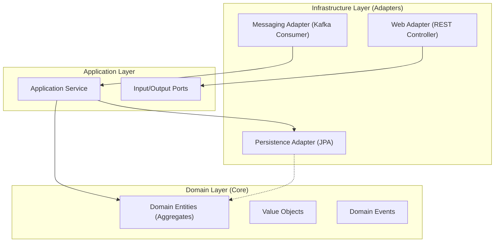

# 🏗️ System Architecture Overview

This document provides a comprehensive high-level view of the E-commerce Backend's architecture. It is designed to help developers understand the system's structure, communication patterns, and key design decisions.

## 🌟 Architectural Style

The system adopts a **Microservices Architecture** with **Event-Driven** communication, aiming for high scalability, loose coupling, and independent deployability.

### Key Patterns used:
*   **Hexagonal Architecture (Ports & Adapters)**: Ensures the core domain logic remains isolated from external infrastructure (Database, API, Messaging).
*   **Domain-Driven Design (DDD)**: The system is modeled around business domains (Order, Product, Inventory, etc.).
*   **CQRS (Lite)**: Separation of command (state change) and query models where necessary.
*   **Saga Pattern**: Manages distributed transactions across services.
*   **Transactional Outbox**: Guarantees data consistency between the database and the message broker.

## Phase 2: Distributed Flow (Implementing)

The system evolves to an event-driven architecture using **Apache Kafka** to handle distributed transactions and eventual consistency.

### Key Components
1.  **Orchestration Saga**: The `Order Service` acts as the orchestrator (Saga Coordinator).
    - It manages the state of the transaction (`PENDING`, `INVENTORY_RESERVED`, `PAYMENT_COMPLETED`, `CONFIRMED`, `CANCELLED`).
    - It publishes events to trigger actions in other services.
    - It handles compensation flows (e.g., releasing stock if payment fails).

2.  **Outbox Pattern**: All services use the Transactional Outbox pattern to ensure reliable event publishing.
    - Events are saved to an `outbox_events` table in the same transaction as the domain state change.
    - A mechanism (Polling Publisher) reads from the table and publishes to Kafka.

3.  **New Services**:
    - **Payment Service**: Listens for `OrderCreated`, processes payment, publishes `PaymentCompleted` or `PaymentFailed`.
    - **Notification Service**: Listens for `OrderConfirmed`, `OrderCancelled`, `PaymentReceived`.
    - **Inventory Service (Updated)**: Now listens for `OrderCreated` to reserve stock and `OrderCancelled` to release stock asynchronously.

### Data Flow (Order Creation)
1.  **Order Service**: Creates Order (PENDING) -> Saves to DB -> Saves `OrderCreated` to Outbox.
2.  **Order Service**: Publishes `OrderCreated` to Kafka.
3.  **Inventory Service**: Consumes `OrderCreated` -> Reserves Stock -> Publishes `StockReserved`.
4.  **Order Service**: Consumes `StockReserved` -> Updates Saga State -> Publishes `RequestPayment`.
5.  **Payment Service**: Consumes `RequestPayment` -> Charges Customer -> Publishes `PaymentCompleted`.
6.  **Order Service**: Consumes `PaymentCompleted` -> Confirms Order -> Publishes `OrderConfirmed`.
7.  **Notification Service**: Consumes `OrderConfirmed` -> Sends Email.

### Compensation Flow (Payment Failed)
1.  **Payment Service**: Publishes `PaymentFailed`.
2.  **Order Service**: Consumes `PaymentFailed` -> Cancels Order -> Publishes `OrderCancelled`.
3.  **Inventory Service**: Consumes `OrderCancelled` -> Releases Stock.
*   **CQRS (Lite)**: Separation of command (state change) and query models where necessary.
*   **Saga Pattern**: Manages distributed transactions across services.
*   **Transactional Outbox**: Guarantees data consistency between the database and the message broker.

---

## 🧩 Service Map (Container Diagram)

The following diagram illustrates the high-level containers and their interactions.

---

## 🏛️ Internal Service Design (Hexagonal)

Every microservice implements **Hexagonal Architecture** to keep the business logic pure.

*   **Domain Layer**: Pure Java code. No Spring annotations (except maybe minimal DI if needed), no Hibernate/JPA annotations. Contains Business Rules.
*   **Application Layer**: Orchestrators. They handle transactions, security checks, and coordinate between the Domain and Infrastructure.
*   **Infrastructure Layer**: The "dirty" details. JPA Repositories, REST Controllers, Kafka Listeners.

---

## 📡 Technology Stack Deep Dive

| Component | Technology | Reasoning |
| :--- | :--- | :--- |
| **Language** | **Java 21** | LTS version, Records, Pattern Matching, Virtual Threads |
| **Framework** | **Spring Boot 3.2+** | Robust ecosystem, native support for Java 21 features |
| **Database** | **PostgreSQL 16** | Reliable, ACID compliance, solid JSONB support |
| **Messaging** | **Apache Kafka** | High throughput, log-based persistence for event sourcing needs |
| **Cache** | **Redis 7** | High-performance caching for transient data (sessions, idempotent keys) |
| **Build** | **Gradle (Kotlin DSL)** | Type-safe build scripts, faster incremental builds |

---

## 🔄 Cross-Cutting Concerns

### 1. Idempotency
To prevent duplicate processing (e.g., creating an order twice due to network retries), we use:
*   **API Level**: `Idempotency-Key` header stored in Redis/DB.
*   **Consumer Level**: `processed_events` table checks unique `eventId` before processing.

### 2. Distributed Locking
*   **Inventory**: Optimistic Locking (`@Version`) for high concurrency.
*   **Outbox**: Database-level `SKIP LOCKED` for safe multi-instance polling.

### 3. Error Handling
*   **Global Exception Handler**: Standardized `ProblemDetail` (RFC 7807) responses.
*   **Retries**: Exponential backoff for transient infrastructure failures.
*   **Compensation**: Saga rollback actions for business logic failures.

---

## 🛡️ Production Readiness & Senior Considerations

While the current architecture is robust, a "Production Grade" system requires addressing these advanced concerns:

### 1. Observability (The "Missing Link")
*   **Distributed Tracing**: Implemented using **Zipkin** and **Micrometer Tracing**. `TraceId` and `SpanId` are propagated across HTTP and Kafka headers, allowing full visualization of `Order -> Payment -> Inventory` flows.
*   **Structured Logging**: All logs should be in JSON format with correlation IDs injected automatically.

### 2. Resilience Patterns
*   **Dead Letter Queues (DLQ)**: If a Kafka consumer fails after N retries, the message must be moved to a DLQ (e.g., `inventory-events.dlq`) to prevent listener blocking. Manual intervention or automated retry scripts can process DLQs.
*   **Circuit Breakers**: For the synchronous call `Order -> Product`, we should verify a Circuit Breaker (Resilience4j) is in place to prevent cascading failures if the Product Service is slow.

### 3. Schema Evolution
*   **Current**: JSON payloads. Flexible but risky.
*   **Senior Recommended**: **Schema Registry** (Avro/Protobuf). Ensures backward/forward compatibility. If we stick to JSON, we need stricter Contract Testing (e.g., Spring Cloud Contract) to prevent breaking consumers.

### 4. Outbox Scalability
*   **Current**: Polling Publisher (Scheduled Task). Simple, low operational complexity.
*   **Scale Up**: For high write throughput, this becomes a bottleneck. The evolution is **Change Data Capture (CDC)** using **Debezium**, which tails the binary log (WAL) of PostgreSQL and pushes to Kafka, removing the polling overhead.
