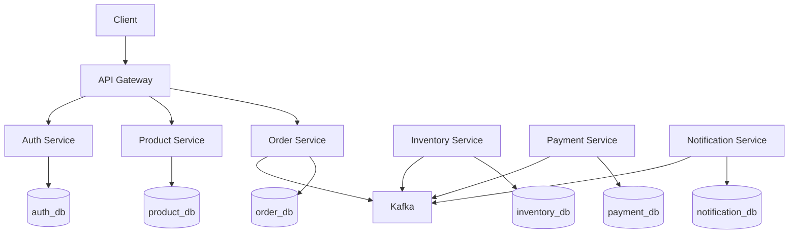

# 🔧 Service Catalog

Detailed documentation for each microservice in the E-commerce Backend.

---

## Service Overview

| Service | Port | Database | Kafka | Description |
|---------|------|----------|-------|-------------|
| [API Gateway](api-gateway.md) | 8080 | - | - | Single entry point, routing, auth |
| [Auth Service](auth-service.md) | 8086 | auth_db | - | Authentication, JWT generation |
| [Product Service](product-service.md) | 8081 | product_db | - | Product catalog management |
| [Inventory Service](inventory-service.md) | 8082 | inventory_db | ✅ | Stock management, reservations |
| [Order Service](order-service.md) | 8083 | order_db | ✅ | Order processing, saga orchestration |
| [Payment Service](payment-service.md) | 8084 | payment_db | ✅ | Payment processing |
| [Notification Service](notification-service.md) | 8085 | notification_db | ✅ | Email/SMS notifications |

---

## Service Dependencies



---

## Service Documentation Template

Each service document includes:
- **Overview**: Purpose and responsibilities
- **API Endpoints**: REST API reference
- **Database Schema**: Tables and relationships
- **Events**: Kafka events produced/consumed
- **Configuration**: Environment variables
- **Deployment**: How to deploy
- **Monitoring**: Key metrics
- **Troubleshooting**: Common issues

---

## Quick Links

### Swagger UI

- API Gateway: http://localhost:8080/swagger-ui.html
- Product Service: http://localhost:8081/swagger-ui.html
- Inventory Service: http://localhost:8082/swagger-ui.html
- Order Service: http://localhost:8083/swagger-ui.html
- Payment Service: http://localhost:8084/swagger-ui.html
- Notification Service: http://localhost:8085/swagger-ui.html
- Auth Service: http://localhost:8086/swagger-ui.html

### Health Checks

```bash
# Check all services
for port in 8080 8081 8082 8083 8084 8085 8086; do
  echo "Port $port:"
  curl -s http://localhost:$port/actuator/health | jq '.status'
done
```

---

**Last Updated**: 2026-01-20  
**Maintained By**: Backend Team
